# 时钟


## 什么是时钟

时钟是单片机运行的基础，时钟信号推动单片机内各个部分执行相应的指令。时钟系统就是CPU的脉搏，决定cpu速率，像人的心跳一样 只有有了心跳，人才能做其他的事情，而单片机有了时钟，才能够运行执行指令，才能够做其他的处理 (点灯，串口，ADC)，时钟的重要性不言而喻。

### 为什么STM32要有多个时钟源呢？

STM32本身十分复杂，外设非常多 但我们实际使用的时候只会用到有限的几个外设，使用任何外设都需要时钟才能启动，但并不是所有的外设都需要系统时钟那么高的频率，为了兼容不同速度的设备，有些高速，有些低速，如果都用高速时钟，势必造成浪费  并且，同一个电路，时钟越快功耗越快，同时抗电磁干扰能力也就越弱，所以较为复杂的MCU都是采用多时钟源的方法来解决这些问题。所以便有了STM32的时钟系统和时钟树

### 总括

STM32时钟系统主要的目的就是给相对独立的外设模块提供时钟，也是为了降低整个芯片的耗能。

系统时钟，是处理器运行时间基准（每一条机器指令一个时钟周期）时钟是单片机运行的基础，时钟信号推动单片机内各个部分执行相应的指令。一个单片机内提供多个不同的系统时钟，可以适应更多的应用场合。不同的功能模块会有不同的时钟上限，因此提供不同的时钟，也能在一个单片机内放置更多的功能模块。对不同模块的时钟增加开启和关闭功能，可以降低单片机的功耗STM32为了低功耗，他将所有的外设时钟都设置为disable(不使能)，用到什么外设，只要打开对应外设的时钟就可以， 其他的没用到的可以还是disable(不使能)，这样耗能就会减少。 这就是为什么不管你配置什么功能都需要先打开对应的时钟的原因。

### STM32的时钟系统框图

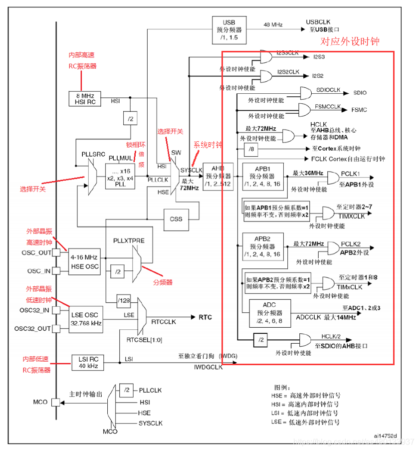


## 时钟系统

各个时钟源(左边的部分)

STM32 有4个独立时钟源:HSI、HSE、LSI、LSE。

1、HSI是高速内部时钟，RC振荡器，频率为8MHz，精度不高。

2、HSE是高速外部时钟，可接石英/陶瓷谐振器，或者接外部时钟源，频率范围为4MHz~16MHz。

3、LSI是低速内部时钟，RC振荡器，频率为40kHz，提供低功耗时钟。　 

4、LSE是低速外部时钟，接频率为32.768kHz的石英晶体。

 

其中LSI是作为IWDGCLK(独立看门狗)时钟源和RTC时钟源，独立使用

而HSI高速内部时钟、HSE高速外部时钟、PLL锁相环时钟 ，这三个经过分频或者倍频，作为系统时钟来使用

PLL为锁相环倍频输出，其时钟输入源可选择为HSI/2、HSE或者HSE/2。倍频可选择为2~16倍，但是其输出频率最大不得超过72MHz。通过倍频之后作为系统时钟的时钟源

举个例子：Keil编写程序是默认的时钟为72Mhz，其实是这么来的：外部晶振(HSE)提供的8MHz（与电路板上的晶振的相关）通过PLLXTPRE分频器后，进入PLLSRC选择开关，进而通过PLLMUL锁相环进行倍频（x9）后，为系统提供72MHz的系统时钟（SYSCLK）。之后是AHB预分频器对时钟信号进行分频，然后为低速外设提供时钟。

 

或者内部RC振荡器(HSI) 为8MHz/2为4MHz，进入PLLSRC选择开关，通过PLLMUL锁相环进行倍频（x16）后 为64MHz

 

PS：网上有很多人说是5个时钟源，这种说法有点问题，学习之后就会发现PLL并不是自己产生的时钟源，而是通过其他三个时钟源倍频得到的时钟

 

### 系统时钟SYSCLK

系统时钟SYSCLK可来源于三个时钟源：

1、HSI振荡器时钟

2、HSE振荡器时钟

3、PLL时钟

最大为72Mhz


### USB时钟

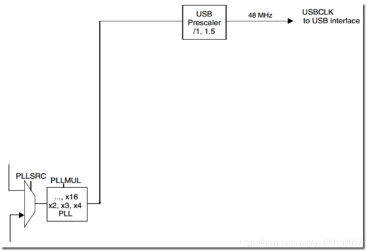

### 把时钟信号输出到外部

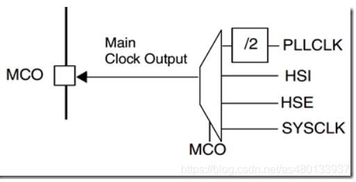


STM32可以选择一个时钟信号输出到MCO脚(PA8)上，可以选择为PLL输出的2分频、HSI、HSE、或者系统时钟。可以把时钟信号输出供外部使用

### 系统时钟通过AHB分频器给外设提供时钟(右边的部分)

从左到右可以简单理解为：系统时钟--->AHB分频器--->各个外设分频倍频器 --->外设时钟的设置

右边部分为：系统时钟SYSCLK通过AHB分频器分频后送给各模块使用，AHB分频器可选择1、2、4、8、16、64、128、256、512分频。其中AHB分频器输出的时钟送给5大模块使用：

①内核总线：送给AHB总线、内核、内存和DMA使用的HCLK时钟。

②Tick定时器：通过8分频后送给Cortex的系统定时器时钟。

③I2S总线：直接送给Cortex的空闲运行时钟FCLK。

④APB1外设：送给APB1分频器。APB1分频器可选择1、2、4、8、16分频，其输出一路供APB1外设使用(PCLK1，最大频率36MHz)，另一路送给通用定时器使用。该倍频器可选择1或者2倍频，时钟输出供定时器2-7使用。

⑤APB2外设：送给APB2分频器。APB2分频器可选择1、2、4、8、16分频，其输出一路供APB2外设使用(PCLK2，最大频率72MHz)，另一路送给高级定时器。该倍频器可选择1或者2倍频，时钟输出供定时器1和定时器8使用。

另外，APB2分频器还有一路输出供ADC分频器使用，分频后送给ADC模块使用。ADC分频器可选择为2、4、6、8分频。

需要注意的是，如果 APB 预分频器分频系数是 1，则定时器时钟频率 (TIMxCLK) 为 PCLKx。否则，定   时器时钟频率将为 APB 域的频率的两倍：TIMxCLK = 2xPCLKx。 

## APB1和APB2的对应外设

F1系列

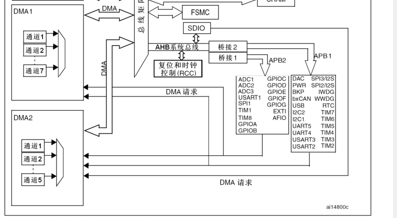

APB1上面连接的是低速外设，包括电源接口、备份接口、CAN、USB、I2C1、I2C2、USART2、USART3、UART4、UART5、SPI2、SP3等；

而APB2上面连接的是高速外设，包括UART1、SPI1、Timer1、ADC1、ADC2、ADC3、所有的普通I/O口（PA-PE）、第二功能I/O（AFIO）口等。

F4系列

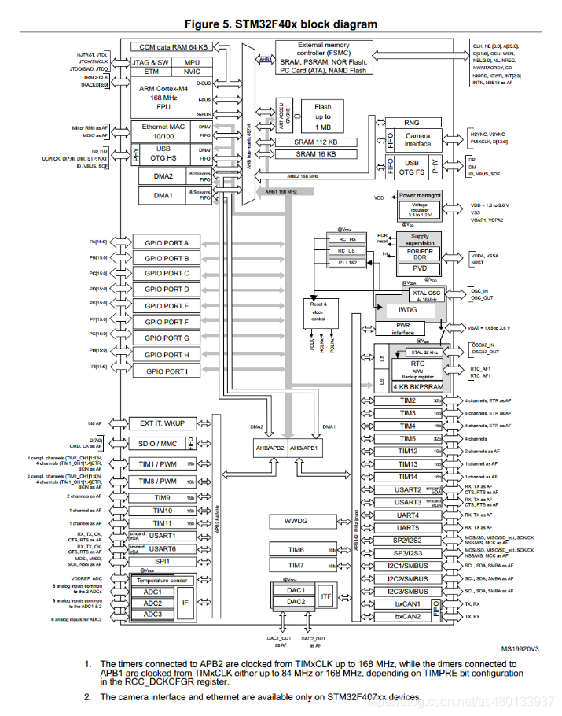

这个和F1系列类似，我们就举几个特殊的

APB2总线：高级定时器timer1, timer8以及通用定时器timer9, timer10, timer11  UTART1,USART6

APB1总线：通用定时器timer2~timer5，通用定时器timer12~timer14以及基本定时器timer6,timer7 UTART2~UTART5

F4系列的系统时钟频率最高能到168M

具体可以在 stm32f10x_rcc.h和stm32f40x_rcc.h中查看或者通过STM32参考手册搜索“系统架构”或者“系统结构”查看外设挂在哪个时钟下

## RCC

### RCC相关寄存器：这里我们以F1系列为例

RCC 寄存器结构，RCC_TypeDeff，在文件“stm32f10x.h”中定义如下：

1059行->1081行。： 

```c
typedef struct 
{ 
vu32 CR;         //HSI,HSE,CSS,PLL等的使能 
vu32 CFGR;       //PLL等的时钟源选择以及分频系数设定 
vu32 CIR;        // 清除/使能 时钟就绪中断 
vu32 APB2RSTR;   //APB2线上外设复位寄存器 
vu32 APB1RSTR;   //APB1线上外设复位寄存器 
vu32 AHBENR;     //DMA，SDIO等时钟使能 
vu32 APB2ENR;    //APB2线上外设时钟使能 
vu32 APB1ENR;   //APB1线上外设时钟使能 
vu32 BDCR;      //备份域控制寄存器 
vu32 CSR;      
} RCC_TypeDef; 
```

 

### RCC初始化

这里我们使用HSE(外部时钟），正常使用的时候也都是使用外部时钟。

使用HSE时钟，程序设置时钟参数流程：

1、将RCC寄存器重新设置为默认值  RCC_DeInit;

2、打开外部高速时钟晶振HSE    RCC_HSEConfig(RCC_HSE_ON);

3、等待外部高速时钟晶振工作   HSEStartUpStatus = RCC_WaitForHSEStartUp();

4、设置AHB时钟     RCC_HCLKConfig;

5、设置高速AHB时钟   RCC_PCLK2Config;

6、设置低速速AHB时钟  RCC_PCLK1Config;

7、设置PLL       RCC_PLLConfig;

8、打开PLL       RCC_PLLCmd(ENABLE);

9、等待PLL工作     while(RCC_GetFlagStatus(RCC_FLAG_PLLRDY) == RESET)

10、设置系统时钟    RCC_SYSCLKConfig;

11、判断是否PLL是系统时钟   while(RCC_GetSYSCLKSource() != 0x08)

12、打开要使用的外设时钟   RCC_APB2PeriphClockCmd()/RCC_APB1PeriphClockCmd()

 ```c
 void RCC_Configuration(void)
 {
 //----------使用外部RC晶振-----------
 RCC_DeInit();            //初始化为缺省值
 RCC_HSEConfig(RCC_HSE_ON);    //使能外部的高速时钟 
 while(RCC_GetFlagStatus(RCC_FLAG_HSERDY) == RESET);    //等待外部高速时钟使能就绪
 FLASH_PrefetchBufferCmd(FLASH_PrefetchBuffer_Enable);    //Enable Prefetch Buffer
 FLASH_SetLatency(FLASH_Latency_2);        //Flash 2 wait state
 RCC_HCLKConfig(RCC_SYSCLK_Div1);        //HCLK = SYSCLK
 RCC_PCLK2Config(RCC_HCLK_Div1);            //PCLK2 = HCLK
 RCC_PCLK1Config(RCC_HCLK_Div2);            //PCLK1 = HCLK/2
 RCC_PLLConfig(RCC_PLLSource_HSE_Div1,RCC_PLLMul_9);    //PLLCLK = 8MHZ * 9 =72MHZ
 RCC_PLLCmd(ENABLE);            //Enable PLLCLK
 while(RCC_GetFlagStatus(RCC_FLAG_PLLRDY) == RESET);    //Wait till PLLCLK is ready
 RCC_SYSCLKConfig(RCC_SYSCLKSource_PLLCLK);    //Select PLL as system clock
 while(RCC_GetSYSCLKSource()!=0x08);        //Wait till PLL is used as system clock source
 //---------打开相应外设时钟--------------------
 RCC_APB2PeriphClockCmd(RCC_APB2Periph_GPIOA,ENABLE);    //使能APB2外设的GPIOA的时钟    
 }
 ```

时钟树框图一步到位完成以上配置。

### 时钟监视系统

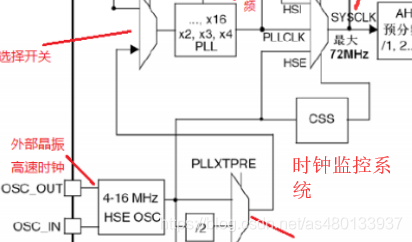

STM32还提供了一个时钟监视系统（CSS），用于监视高速外部时钟（HSE）的工作状态。倘若HSE失效，会自动切换（高速内部时钟）HSI作为系统时钟的输入，保证系统的正常运行。

# GPIO

## 使用方法

```c
1，使能时钟
__HAL_RCC_GPIOx_CLK_ENABLE()
2，设置工作模式
HAL_GPIO_Init()
3，设置输出状态（可选）
HAL_GPIO_WritePin() 
HAL_GPIO_TogglePin()
4，读取输入状态（可选）
HAL_GPIO_ReadPin()

```

## GPIO相关结构体

```c
typedef struct 
{ 
  uint32_t Pin;        /* 引脚号 */ 
  uint32_t Mode;   /* 模式设置 */ 
  uint32_t Pull;       /* 上拉下拉设置 */ 
  uint32_t Speed;  /* 速度设置 */ 
} GPIO_InitTypeDef;
```

F4/F7/H7

```c
typedef struct 
{ 
  uint32_t Pin;              /* 引脚号 */ 
  uint32_t Mode;         /* 模式设置 */ 
  uint32_t Pull;            /* 上拉下拉设置 */ 
  uint32_t Speed;       /* 速度设置 */
  uint32_t Alternate; /* 复用功能 */
} GPIO_InitTypeDef;

```

| **GPIO八种模式**   | **特点及应用**                              |
| ------------------ | ------------------------------------------- |
| **输入浮空**       | 输入用，完全浮空，状态不定                  |
| **输入上拉**       | 输入用，用内部上拉，默认是高电平            |
| **输入下拉**       | 输入用，用内部下拉，默认是低电平            |
| **模拟功能**       | ADC、DAC                                    |
| **开漏输出**       | 软件IIC的SDA、SCL等                         |
| **推挽输出**       | 驱动能力强，25mA（max），通用输出           |
| **开漏式复用功能** | 片上外设功能（硬件IIC 的SDA、SCL引脚等）    |
| **推挽式复用功能** | 片上外设功能（SPI 的SCK、MISO、MOSI引脚等） |

## 相关函数

### **初始化与取消初始化**

```c
void HAL_GPIO_Init (GPIO_TypeDef * GPIOx, GPIO_InitTypeDef * GPIO_Init)
```

参数说明：

GPIOx 所要初始化的GPIO分组，x可选范围（A…K）（STM32F429）

GPIO_Init GPIO初始化结构体的指针，该结构体定义了一些GPIO引脚的参数

```
void HAL_GPIO_DeInit (GPIO_TypeDef * GPIOx, uint32_t GPIO_Pin)
```

​	用于注销某个GPIO外设，参数同上

### **写入某个GPIO引脚的值**

```c
HAL_GPIO_WritePin(GPIO_TypeDef * GPIOx, uint16_t GPIO_Pin,GPIO_PinState pinstate);
```

参数说明：

​	GPIOx 所要初始化的GPIO分组，x可选范围（A…K）（STM32F429）

​	GPIO_PIN_x，x可选范围(0…15)，具体参考相关宏定义

​	Pinstate 状态，RESET 是0，SET 是1

 

**读取某个GPIO引脚的值**

```c
GPIO_PinState HAL_GPIO_ReadPin (GPIO_TypeDef * GPIOx, uint16_t GPIO_Pin)
```

参数说明：

​	GPIOx 所要初始化的GPIO分组，x可选范围（A…K）（STM32F429）

​	GPIO_PIN_x，x可选范围(0…15)，具体参考相关宏定义

**设定某个GPIO引脚的值**

```c
void HAL_GPIO_WritePin (GPIO_TypeDef, uint16_t GPIO_Pin, GPIO_PinState PinState)
```

参数说明：

​	PinState 引脚状态：

​	GPIO_PIN_RESET：低电平

​	GPIO_PIN_SET：高电平


**切换某个GPIO引脚的状态，高电平->低电平 或 低电平->高电平**

```c
void HAL_GPIO_TogglePin ( GPIO_TypeDef * GPIOx, uint16_t GPIO_Pin)
```

 

**锁定某个GPIO引脚的一些配置寄存器**

```c
HAL_StatusTypeDef HAL_GPIO_LockPin (GPIO_TypeDef * GPIOx, uint16_t GPIO_Pin)
```

包括：GPIOx_MODER GPIOx_OTYPER GPIOx_OSPEEDR GPIOx_PUPDR GPIOx_AFRL GPIOx_AFRH。

上述寄存器将无法被更改直到下次单片机reset

HAL Status：HAL库函数执行的状态，包括4种状态：

```c
typedefenum{
    HAL_OK = 0x00,
	HAL_ERROR = 0x01, 
	HAL_BUSY = 0x02, 
	HAL_TIMEOUT = 0x03
}HAL_StatusTyperDef;
```

 

**GPIO引脚外部中断处理的公共入口函数（了解）**

```c
void HAL_GPIO_EXTI_IRQHandler (uint16_t GPIO_Pin)
```

该函数需要在中断服务函数EXTIx_IRQHandler()中被调用，

此函数作用是清除中断标志位,之后进HAL_GPIO_EXTI_Callback（中断回调函数），处理完中断回调函数的事件后，再退出中断，所以我们一般都是将需要响应的事件代码写入中断回调函数中


 ```c
 void HAL_GPIO_EXTI_IRQHandler(uint16_tGPIO_Pin){
   /* EXTI line interrupt detected */if(__HAL_GPIO_EXTI_GET_IT(GPIO_Pin) != RESET)
   {
     __HAL_GPIO_EXTI_CLEAR_IT(GPIO_Pin);
     HAL_GPIO_EXTI_Callback(GPIO_Pin);
   }
 }
 ```


**外部中断回调函数**

```c
__weak void HAL_GPIO_EXTI_Callback (uint16_t GPIO_Pin)
```

GPIO引脚外部中断的回调函数，该函数将在HAL_GPIO_EXTI_IRQHandler()函数中被调用
 用户通过重构该函数来实现中断触发后的逻辑，并且无需考虑重置中断标识符。

参数说明：
 ​ GPIO_Pin 触发外部中断的引脚序号（等同与中断线的序号）

## **相关宏定义**

### **GPIO Alternate Function Selection 复用功能列表**

```c
GPIO_AF0_RTC_50Hz
GPIO_AF0_MCO
GPIO_AF0_TAMPER
GPIO_AF0_SWJ
GPIO_AF0_TRACE
GPIO_AF1_TIM1
GPIO_AF1_TIM2
GPIO_AF2_TIM3
GPIO_AF2_TIM4
GPIO_AF2_TIM5
GPIO_AF3_TIM8
GPIO_AF3_TIM9
GPIO_AF3_TIM10
GPIO_AF3_TIM11
GPIO_AF4_I2C1
GPIO_AF4_I2C2
GPIO_AF4_I2C3
GPIO_AF5_SPI1
GPIO_AF5_SPI2
GPIO_AF5_SPI3
GPIO_AF5_SPI4
GPIO_AF5_SPI5
GPIO_AF5_SPI6
GPIO_AF5_I2S3ext
GPIO_AF6_SPI3
GPIO_AF6_I2S2ext
GPIO_AF6_SAI1
GPIO_AF7_USART1
GPIO_AF7_USART2
GPIO_AF7_USART3
GPIO_AF7_I2S3ext
GPIO_AF8_UART4
GPIO_AF8_UART5
GPIO_AF8_USART6
GPIO_AF8_UART7
GPIO_AF8_UART8
GPIO_AF9_CAN1
GPIO_AF9_CAN2
GPIO_AF9_TIM12
GPIO_AF9_TIM13
GPIO_AF9_TIM14
GPIO_AF9_LTDC
GPIO_AF9_QSPI
GPIO_AF10_OTG_FS
GPIO_AF10_OTG_HS
GPIO_AF10_QSPI
GPIO_AF11_ETH
GPIO_AF12_FMC
GPIO_AF12_OTG_HS_FS
GPIO_AF12_SDIO
GPIO_AF13_DCMI
GPIO_AF13_DSI
GPIO_AF14_LTDC
GPIO_AF15_EVENTOUT
```

### **GPIO mode define GPIO模式宏定义列表**

| **宏定义**                   | **解释**                |
| ---------------------------- | ----------------------- |
| GPIO_MODE_INPUT              | 浮空输入                |
| GPIO_MODE_OUTPUT_PP          | 推挽输出                |
| GPIO_MODE_OUTPUT_OD          | 开漏输出                |
| GPIO_MODE_AF_PP              | 推挽复用输出            |
| GPIO_MODE_AF_OD              | 开漏复用输出            |
| GPIO_MODE_ANALOG             | 模拟                    |
| GPIO_MODE_IT_RISING          | 上升沿触发外部中断      |
| GPIO_MODE_IT_FALLING         | 下降沿触发外部中断      |
| GPIO_MODE_IT_RISING_FALLING  | 上升/下降沿触发外部中断 |
| GPIO_MODE_EVT_RISING         | 上升沿触发外部事件      |
| GPIO_MODE_EVT_FALLING        | 下降沿触发外部事件      |
| GPIO_MODE_EVT_RISING_FALLING | 上升/下降沿触发外部事件 |

### **GPIO pins define GPIO引脚序列定义列表**

```c
GPIO_PIN_0
GPIO_PIN_1
GPIO_PIN_2
GPIO_PIN_3
GPIO_PIN_4
GPIO_PIN_5
GPIO_PIN_6
GPIO_PIN_7
GPIO_PIN_8
GPIO_PIN_9
GPIO_PIN_10
GPIO_PIN_11
GPIO_PIN_12
GPIO_PIN_13
GPIO_PIN_14
GPIO_PIN_15
GPIO_PIN_All
GPIO_PIN_MASK
```

### **GPIO pull define GPIO上下拉定义列表**

| **宏定义**    | **解释**     |
| ------------- | ------------ |
| GPIO_NOPULL   | 不激活上下拉 |
| GPIO_PULLUP   | 上拉激活     |
| GPIO_PULLDOWN | 下拉激活     |

### **GPIO speed define GPIO速度定义列表**

| **宏定义**                | **解释**               |
| :------------------------ | ---------------------- |
| GPIO_SPEED_FREQ_LOW       | 工作速度 2MHz          |
| GPIO_SPEED_FREQ_MEDIUM    | 工作速度 12.5MHz~50MHz |
| GPIO_SPEED_FREQ_HIGH      | 工作速度 50MHz~100MHz  |
| GPIO_SPEED_FREQ_VERY_HIGH | 工作速度 100MHz~200MHz |

# 外部中断

## 使用方法

### STM32 EXTI的HAL库设置步骤（外部中断）

```c
1，使能GPIO时钟
使用：__HAL_RCC_GPIOx_CLK_ENABLE
2，GPIO/AFIO(SYSCFG)/EXTI
HAL_GPIO_Init，一步到位
3，设置中断优先级
HAL_NVIC_SetPriority
4，使能中断
HAL_NVIC_EnableIRQ
5，设计中断回调函数
编写：void HAL_GPIO_EXTI_Callback(uint16_t GPIO_Pin)
```

STM32F1仅有：EXTI0~4、EXTI9_5、EXTI15_10，7个外部中断服务函数

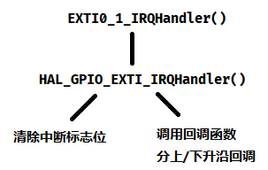


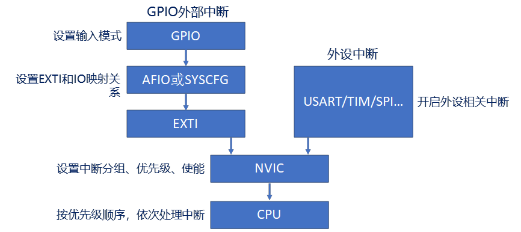

## 详细介绍

### **中断和事件的理解：**

中断：要进入NVIC，有相应的中断服务函数，需要CPU处理

事件：不进入NVIC，仅用于内部硬件自动控制的，如：TIM、DMA、ADC

### **STM32的外部中断线：**

STM32的每个IO都可以作为外部中断输入，STM32F1的中断控制器支持19个外部中断/事件请求：

线0~15：对应外部IO口的输入中断。

线16：连接到PVD输出。

线17：连接到RTC闹钟事件。

线18：连接到USB唤醒事件。

每个外部中断线可以独立的配置触发方式（上升沿，下降沿或者双边沿触发），触发/屏蔽，专用的状态位。

### **EXTI 介绍**

EXTI 即是外部中断和事件控制器，它是由 20 个产生事件/中断请求的边沿检测器组成。每一条输入线都可以独立地配置输入类型（脉冲或挂起）和对应的触发事件（上升沿或下降沿或者双边沿都触发）。每个输入线都可以独立地被屏蔽。挂起寄存器保持着状态线的中断请求。

### EXTI 的功能框图（F4）

EXTI 的功能框图是最直接把有关 EXTI 的知识点连接起来的图，掌握了该图的来龙去脉，就会对 EXTI 有了一个整体熟悉，编程时候可以得心应手。


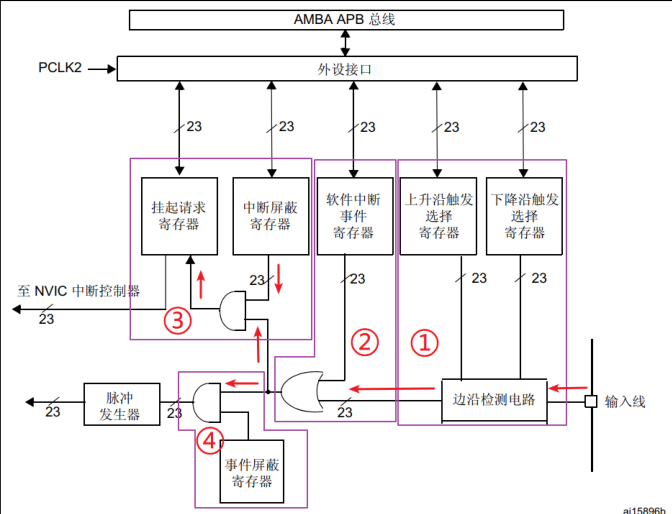

从 EXTI 功能框图可以看到有两条主线，一条是由输入线到 NVIC 中断控制器，一条是由输入线到脉冲发生器。这就恰恰是 EXTI 的两大部分功能，产生中断与产生事件，两者从硬件上就存在不同。

下面让我们看一下 EXTI 功能框图的产生中断的线路，最终信号是流入 NVIC 控制器中。输入线是线路的信息输入端，它可以通过配置寄存器设置为任何一个 GPIO 口，或者是一些外设的事件。输入线一般都是存在电平变化的信号。

标号①是一个边沿检测电路，包括边沿检测电路，上升沿触发选择寄存器(EXTI_RTSR)和下降沿触发选择寄存器(EXTI_FTSR)。边沿检测电路以输入线作为信号输入端，如果检测到有边沿跳变就输出有效信号‘1’，就输出有效信号‘1’到标号②部分电路，否则输入无效信号‘0’。边沿跳变的标准在于开始的时候对于上升沿触发选择寄存器或下降沿触发选择寄存器对应位的设置，对应位的设置可以参照一下表 16.1.1.2.1。

标号②是一个或门电路，它的两个信号输入端分别是软件中断事件寄存器(EXTI_SWIER)和边沿检测电路的输入信号。或门电路只要输入端有信号‘1’，就会输出‘1’，所以就会输出‘1’到标号③电路和标号④电路。通过对软件中断事件寄存器的读写操作就可以启动中断/事件线，即相当于输出有效信号‘1’到或门电路输入端。

标号③是一个与门电路，它的两个信号输入端分别是中断屏蔽寄存器(EXTI_IMR)和标号②电路输出信号。与门电路要求输入都为‘1’才输出‘1’，这样子的情况下，如果中断屏蔽寄存器(EXTI_IMR)设置为 0 时，不管从标号②电路输出的信号特性如何，最终标号③电路输出的信号都是 0；假如中断屏蔽寄存器(EXTI_IMR)设置为 1 时，最终标号③电路输出的信号才由标号②电路输出信号决定，这样子就可以简单控制 EXTI_IMR 来实现中断的目的。标号④电路输出‘1’就会把请求挂起寄存器(EXTI_PR)对应位置 1。

最后，请求挂起寄存器(EXTI_PR)的内容就输出到 NVIC 内，实现系统中断事件的控制。

接下来我们看看 EXTI 功能框图的产生事件的线路。

产生事件线路是从标号2之后与中断线路有所不用，之前的线路都是共用的。标号④是一个与门，输入端来自标号 2 电路以及来自于事件屏蔽寄存器(EXTI_EMR)。如果 EXTI_EMR 寄存器设置为 0，那不管标号 2 电路输出的信号是‘0’还是‘1’，最终标号 4 输出的是‘0’；如果 EXTI_EMR 寄存器设置为 1，最终标号④电路输出信号就由标号③电路输出的信号决定，这样子就可以简单的控制 EXTI_EMR 来实现是否产生事件的目的。

标号④电路输出有效信号 1 就会使脉冲发生器电路产生一个脉冲，而无效信号就不会使其产生脉冲信号。脉冲信号产生可以给其他外设电路使用，例如定时器，模拟数字转换器等，这样的脉冲信号一般用来触发 TIM 或者 ADC 开始转换。

产生中断线路目的使把输入信号输入到 NVIC，进一步运行中断服务函数，实现功能。而产生事件线路目的是传输一个脉冲信号给其他外设使用，属于硬件级功能。

EXTI 支持 23 个外部中断/事件请求，这些都是信息输入端，也就是上面提及到了输入线，具体如下：

EXTI 线 0~15：对应外部 IO 口的输入中断

EXTI 线 16：连接到 PVD 输出

EXTI 线 17：连接到 RTC 闹钟事件

EXTI 线 18：连接到 USB 唤醒事件

EXTI 线 19：连接到以太网唤醒事件

EXTI 线 20：连接到 USB OTG HS（在 FS 中配置）唤醒事件

EXTI 线 21：连接到 RTC 入侵和时间戳事件

EXTI 线 22：连接到 RTC 唤醒事件

从上面可以看出，STM32F407 供给 IO 口使用的中断线只有 16 个，但是 STM32F407 的 IO口却远远不止 16 个，所以 STM32 把 GPIO 管脚 GPIOx.0~GPIOx.15(x=A,B,C,D,E,F,G)分别对应中断线 0~15。这样子每个中断线对应了最多 7 个 IO 口，以线 0 为例：它对应了GPIOA.0、GPIOB.0、GPIOC.0、GPIOD.0、GPIOE.0、GPIOF.0 和 GPIOG.0。而中断线每次只能连接到 1 个IO 口上，这样就需要通过配置决定对应的中断线配置到哪个 GPIO 上了。

##  宏定义

```c
__HAL_GPIO_EXTI_GET_FLAG(__EXTI_LINE__) //检查指定的中断线的标志位
__HAL_GPIO_EXTI_GET_IT(__EXTI_LINE__) //检查指定的中断线的标志位
__HAL_GPIO_EXTI_CLEAR_FLAG(__EXTI_LINE__) //清除中断标志
__HAL_GPIO_EXTI_CLEAR_IT(__EXTI_LINE__) //清除中断标志
__HAL_GPIO_EXTI_GENERATE_SWIT(__EXTI_LINE__) //生成软件中断
```

| 中断/事件线 | 输入源                         |
| ----------- | ------------------------------ |
| EXTI0       | PX0(X可为A,B,C,D,E,F,G,H,I)    |
| EXTI1       | PX1(X可为A,B,C,D,E,F,G,H,I)    |
| EXTI2       | PX2(X可为A,B,C,D,E,F,G,H,I)    |
| EXTI3       | PX3(X可为A,B,C,D,E,F,G,H,I)    |
| EXTI4       | PX4(X可为A,B,C,D,E,F,G,H,I)    |
| EXTI5       | PX5(X可为A,B,C,D,E,F,G,H,I)    |
| EXTI6       | PX6(X可为A,B,C,D,E,F,G,H,I)    |
| EXTI7       | PX7(X可为A,B,C,D,E,F,G,H,I)    |
| EXTI8       | PX8(X可为A,B,C,D,E,F,G,H,I)    |
| EXTI9       | PX9(X可为A,B,C,D,E,F,G,H,I)    |
| EXTI10      | PX10(X可为A,B,C,D,E,F,G,H,I)   |
| EXTI11      | PX11(X可为A,B,C,D,E,F,G,H,I)   |
| EXTI12      | PX12(X可为A,B,C,D,E,F,G,H,I)   |
| EXTI13      | PX13(X可为A,B,C,D,E,F,G,H,I)   |
| EXTI14      | PX14(X可为A,B,C,D,E,F,G,H,I)   |
| EXTI15      | PX15(X可为A,B,C,D,E,F,G,H,I)   |
| EXTI16      | PVD输出                        |
| EXTI17      | RTC闹钟事件                    |
| EXTI18      | USB唤醒事件                    |
| EXTI19      | 以太网唤醒事件（只适用互联型） |

# 串口

## 波特率计算方法

波特率

即每秒钟传输的码元个数，在二进制系统中（串口的数据帧就是二进制的形式），

波特率与波特率的数值相等，所以我们今后在把串口波特率理解为每秒钟传输的二进制位数。

波特率通过以下公式得出：

​	$$baud=\frac{fck}{16*USARTDIV}$$

fck 是给串口的时钟（USART2\3 和 UART4\5 的时钟源为 PCLK1，USART1\6 的时钟源为PCLK2），USARTDIV 是一个无符号的定点数，存放在波特率寄存器（USART_BRR）的低16位，DIV_Mantissa[11:0]存放的是 USARTDIV 的整数部分， DIV_Fractionp[3:0]存放的是USARTDIV 的小数部分。

下面举个例子说明：

当串口 1 设置需要得到 115200 的波特率，fck = 84MHz，那么可得：

​	$$115200=\frac{84000000}{16*USARTDIV}$$

得到 USARTDIV ≈ 45.5729，分离 USARTDIV 的整数部分与小数部分，整数部分为 45，即 0x2D，那么 DIV_Mantissa = 0x2D；小数部分为 0.5729，转化为十六进制即 0.5729*16 ≈ 9，所以 DIV_Fractionp = 0x9，USART_BRR 寄存器应该赋值为 0x2D9，成功设置波特率为115200。

值得注意 USARTDIV 是允许有余数的，我们用四舍五入进行取整，这样会导致波特率会有所偏差，而这样的小误差是可以被允许的

## 相关函数

### **初始化与取消初始化（了解）**

```c
HAL_StatusTypeDef HAL_UART_Init(UART_HandleTypeDef *huart)
```

用于初始化某个串口
 参数说明：

*huart 所要初始化串口的句柄

```C
HAL_StatusTypeDef HAL_UART_DeInit(UART_HandleTypeDef *huart)
```

用于注销某个串口，参数同上

### **串口发送/接收数据**

```C
HAL_UART_Transmit(UART_HandleTypeDef *huart, uint8_t *pData, uint16_t Size, uint32_t Timeout)
```

功能：串口发送指定长度的数据。如果超时没发送完成，则不再发送，返回超时标志（HAL_TIMEOUT）。

参数说明：

UART_HandleTypeDef *huart   UATR的别名，如:UART_HandleTypeDef huart1;  别名就是huart1 

*pData   需要发送的数据 

Size  发送的字节数

Timeout  最大发送时间，发送数据超过该时间退出发送  

举例：

```C
HAL_UART_Transmit(&huart1, (uint8_t *)ZZX, 3, 0xffff);  //串口发送三个字节数据，最大传输时间0xffff
```

 

### **接收数据事件函数**

```C
HAL_StatusTypeDef HAL_UARTEx_ReceiveToIdle ( UART_HandleTypeDef * huart, uint8_t * pData, uint16_t Size, uint16_t * RxLen, uint32_t Timeout) 
```

在阻塞模式下接收一定数量的数据，直到接收到预期数量的数据或发生IDLE事件。

注意：如果接收完成（已接收到预期数量的数据）或在IDLE事件后停止接收（已接收的数据少于预期数量），则返回HAL_OK。在这种情况下，RxLen输出参数表示接收缓冲区中可用的数据数量。当UART奇偶校验未启用（PCE=0），并且字长配置为9位（M=01）时，接收的数据被处理为uint16_t的集合。在这种情况下，Size必须指示通过pData可用的uint16_t的数量。

参数：

huart UART句柄。

pData指向数据缓冲区（uint8_t或uint16_t数据元素）的指针。

Size要接收的数据元素（uint8_t或uint16_t）的数量。

RxLen最终接收到的数据元素数（可能低于Size，以防接收在IDLE事件结束）

Timeout超时持续时间，单位为ms（包括整个接收序列）。

返回值：HAL状态

 

### **中断发送数据**

```C
HAL_StatusTypeDef HAL_UART_Transmit_IT(UART_HandleTypeDef *huart, uint8_t *pData, uint16_t Size)
```

用法：先调用HAL_UART_Transmit_IT()发送数据然后在HAL_UART_TxCpltCallback()里写上发送完成后的处理内容，用户自定义。

注意：HAL_UART_Transmit_IT()要等待上次发送完成后再发送，否则返回HAL_BUSY。用huart->gState == HAL_UART_STATE_READY判断上次是否发送完成。

相较于HAL_UART_Transmit()一直阻塞在while循环（函数内部）里等待直到所有数据发送完毕，HAL_UART_Transmit_IT()以中断模式发送，函数内容仅仅为把数据信息传递给串口句柄结构体变量，然后就可以去执行别的内容了。

```c
huart->pTxBuffPtr = pData;
huart->TxXferSize = Size;
huart->TxXferCount = Size;
```

什么？传递一下就完了？对，剩下的工作由老大哥串口总中断调用的void HAL_UART_IRQHandler(UART_HandleTypeDef *huart)来完成，最后两个判断内容就是为它服务的。

```c
/* USART in mode Transmitter -----*/
if (((isrflags & USART_SR_TXE) != RESET) && ((cr1its & USART_CR1_TXEIE) != RESET))
{
if (husart->State == HAL_USART_STATE_BUSY_TX)
{
  USART_Transmit_IT(husart);
}
else
{
  USART_TransmitReceive_IT(husart);
}
return;
}
/* USART in mode Transmitter (transmission end)*/
if (((isrflags & USART_SR_TC) != RESET) && ((cr1its & USART_CR1_TCIE) != RESET))
{
USART_EndTransmit_IT(husart);
return;
}
```

可以看到，发送完成会调用UART_EndTransmit_IT(huart)，这哥们儿会调用HAL_UART_TxCpltCallback(huart)，没错你去定义它，然后写上发送完要干什么事情就行了。

```c
static HAL_StatusTypeDef UART_EndTransmit_IT(UART_HandleTypeDef *huart)
{
  /* Disable the UART Transmit Complete Interrupt */
  __HAL_UART_DISABLE_IT(huart, UART_IT_TC);

  /* Tx process is ended, restore huart->gState to Ready */
  huart->gState = HAL_UART_STATE_READY;

#if (USE_HAL_UART_REGISTER_CALLBACKS == 1)
  /*Call registered Tx complete callback*/
  huart->TxCpltCallback(huart);
#else
  /*Call legacy weak Tx complete callback*/
  HAL_UART_TxCpltCallback(huart);
#endif /* USE_HAL_UART_REGISTER_CALLBACKS */

  return HAL_OK;
}
```

### **开启中断接收数据**

```c
HAL_StatusTypeDef HAL_UART_Receive_IT(UART_HandleTypeDef *huart, uint8_t *pData, uint16_t Size)
```

功能：串口中断接收，以中断方式接收指定长度数据。此函数可以指定，每收到若干个数据，调用一次回调函数；这是因为，每收到一个字节，都会把此函数的接收计数器-1，如果接收计数器为零，调用串口接收回调函数HAL_UART_RxCpltCallback，随后不再触发接收中断。(只触发一次中断，实际上HAL库一共提供了5个回调函数，只有这个函数在接收完成时调用）。

在main函数里面首先写下它，否则无法进入串口中断（亲测如此），其次还要在回调函数里面添加这个函数（因为之前就说过一旦进入回调函数，串口中断就会关闭），为了下一次接收数据考虑，需要这么做。

*前三个参数和阻塞方式完全一致，为什么没有超时时间了呢？*

*因为中断(IT)方式配置完成寄存器之后不需要再占用CPU，会在接受完成后触发中断。*

*阻塞方式就好比你要拿快递，就一遍遍都前台询问快递到没到，在这期间你不能干别的，*

*中断方式是你告诉前台快递到了给你打电话，在这期间你是可以腾出身子来干别的事情。*

*由此可见，中断方式效率大于阻塞方式，极端情况下，中断方式的安全性也高于阻塞方式*

参数：

*huart   句柄，如&huart1 

*pData   接收到的数据存放地址

Size  想要接收的字节数

举例：

```c
HAL_UART_Receive_IT(&huart1,(uint8_t *)&value,1);  //中断接收一个字符，存储到value中。
```

 

### **中断接收数据事件函数**

```c
HAL_StatusTypeDef HAL_UARTEx_ReceiveToIdle_IT (UART_HandleTypeDef * huart,uint8_t *pData,uint16_t Size) 
```

在中断模式下接收一定数量的数据，直到接收到预期数量的数据或发生IDLE事件。

注意：接收由此功能调用启动。由于RXNE和IDLE事件引发的UART中断，实现了接收的进一步进展。在接收结束时调用回调，指示接收到的数据元素的数量。当UART奇偶校验未启用（PCE=0），并且字长配置为9位（M=01）时，接收的数据被处理为uint16_t的集合。在这种情况下，Size必须指示通过pData可用的uint16_t的数量。

参数：

huart UART句柄。

pData指向数据缓冲区（uint8_t或uint16_t数据元素）的指针。

Size要接收的数据元素（uint8_t或uint16_t）的数量。

返回值：HAL状态

### **发送完成回调函数**

```c
__weak void HAL_UART_TxCpltCallback (UART_HandleTypeDef *huart) 
```

功能：HAL库的中断进行完之后，并不会直接退出，而是会进入该函数中，用户可以在其中设置代码，串口中断发送完成之后，会进入该函数，该函数为空函数，用户需自行修改，

参数：

UART_HandleTypeDef *huart   UATR的别名  如 :  UART_HandleTypeDef huart1;  别名就是huart1 

举例：

```c
HAL_UART_TxCpltCallback(&huart1){  用户设定的代码  }
```

### **接收完成回调函数**

```c
__weak HAL_UART_RxCpltCallback(UART_HandleTypeDef *huart); 
```

功能：HAL库的中断进行完之后，并不会直接退出，而是会进入该函数中，用户可以在其中设置代码，串口中断接收完成之后，会进入该函数，该函数为空函数，用户需自行修改，

参数：

UART_HandleTypeDef *huart   UATR的别名  如 :  UART_HandleTypeDef huart1;  别名就是huart1 

举例：

```c
HAL_UART_RxCpltCallback(&huart1){  用户设定的代码  }
```

 

### **串口DMA发送函数**

```c
HAL_UART_Transmit_DMA(UART_HandleTypeDef *huart, uint8_t *pData, uint16_t Size)
```

函数主要功能是以DAM模式发送pData指针指向的数据中固定长度的数据，并同时设置和使能DMA中断。DMA中断函数最终调用的其实是串口的中断函数。进入到HAL_UART_Transmit_DMA这个函数中可以看到，它将DMA传输完成、半完成、错误的回调函数分别定向到了串口DMA传输完成、半完成、错误的回调函数UART_DMATransmitCplt、UART_DMATxHalfCplt、UART_DMAError。

```c
HAL_StatusTypeDef HAL_UART_Transmit_DMA(UART_HandleTypeDef *huart, const uint8_t *pData, uint16_t Size)
{
  const uint32_t *tmp;

  /* Check that a Tx process is not already ongoing */
  if (huart->gState == HAL_UART_STATE_READY)
  {
    if ((pData == NULL) || (Size == 0U))
    {
      return HAL_ERROR;
    }

    huart->pTxBuffPtr = pData;
    huart->TxXferSize = Size;
    huart->TxXferCount = Size;

    huart->ErrorCode = HAL_UART_ERROR_NONE;
    huart->gState = HAL_UART_STATE_BUSY_TX;

    /* Set the UART DMA transfer complete callback */
    huart->hdmatx->XferCpltCallback = UART_DMATransmitCplt;

    /* Set the UART DMA Half transfer complete callback */
    huart->hdmatx->XferHalfCpltCallback = UART_DMATxHalfCplt;

    /* Set the DMA error callback */
    huart->hdmatx->XferErrorCallback = UART_DMAError;

    /* Set the DMA abort callback */
    huart->hdmatx->XferAbortCallback = NULL;
```

再进入到UART_DMATransmitCplt函数中可以看到，它最终其实是调用了__weak void HAL_UART_TxCpltCallback(UART_HandleTypeDef *huart)这一个串口发送完成的回调函数。我们经常使用的是另一个串口接收完成回调函数__weak void HAL_UART_RxCpltCallback(UART_HandleTypeDef *huart)。 所以我们需要做的就是重写 __weak void HAL_UART_TxCpltCallback(UART_HandleTypeDef *huart)这一个回调函数，进行中断处理。这个回调函数我们要用到

```C
static void UART_DMATransmitCplt(DMA_HandleTypeDef *hdma)
{
  UART_HandleTypeDef *huart = (UART_HandleTypeDef *)((DMA_HandleTypeDef *)hdma)->Parent;
  /* DMA Normal mode*/
  if ((hdma->Instance->CCR & DMA_CCR_CIRC) == 0U)
  {
    huart->TxXferCount = 0x00U;

    /* Disable the DMA transfer for transmit request by setting the DMAT bit
       in the UART CR3 register */
    ATOMIC_CLEAR_BIT(huart->Instance->CR3, USART_CR3_DMAT);

    /* Enable the UART Transmit Complete Interrupt */
    ATOMIC_SET_BIT(huart->Instance->CR1, USART_CR1_TCIE);

  }
  /* DMA Circular mode */
  else
  {
#if (USE_HAL_UART_REGISTER_CALLBACKS == 1)
    /*Call registered Tx complete callback*/
    huart->TxCpltCallback(huart);
#else
    /*Call legacy weak Tx complete callback*/
    HAL_UART_TxCpltCallback(huart);
#endif /* USE_HAL_UART_REGISTER_CALLBACKS */
  }
}
```

### **串口DMA接收函数**

```C
HAL_StatusTypeDef HAL_UART_Receive_DMA(UART_HandleTypeDef *huart, uint8_t *pData, uint16_t Size)
```

函数说明：此函数的功能在DMA模式下接收大量数据，同时设置DMA线和哪个串口外设连接，以及将DMA线接收到的数据搬 *pData对应地内存中，和上面DMA发送函数一样，此函数同时具有设置和使能DMA中断的功能。

如前所说，一直跳转，可以看到接收完成后会调用串口接收完成回调函数__weak void HAL_UART_RxCpltCallback(UART_HandleTypeDef *huart)。但是请注意我们用不到这个函数，因为我们将要使用到串口空闲中断，中断处理逻辑全部放在空闲中断中

 

### **DMA接收数据事件函数**

```C
HAL_StatusTypeDef HAL_UARTEx_ReceiveToIdle_DMA ( UART_HandleTypeDef * huart, uint8_t * pData, uint16_t Size)
```

在DMA模式下接收一定数量的数据，直到接收到预期数量的数据或发生IDLE事件。

注意：接收由此功能调用启动。DMA服务实现了接收的进一步进展，在用户接收缓冲区中传输自动接收的数据元素，并在接收的一半/结束时调用注册的回调。UART IDLE事件也用于将接收阶段视为结束。在所有情况下，回调执行都将指示接收到的数据元素的数量。当UART奇偶校验被启用（PCE=1）时，接收的数据包含奇偶校验位（MSB位置）。当UART奇偶校验未启用（PCE=0），并且字长配置为9位（M=01）时，接收的数据被处理为uint16_t的集合。在这种情况下，Size必须指示通过pData可用的uint16_t的数量。

参数：

huart UART句柄。

pData指向数据缓冲区（uint8_t或uint16_t数据元素）的指针。

Size要接收的数据元素（uint8_t或uint16_t）的数量。

返回值：HAL状态

 

### **接收数据事件回调函数（了解）**

```C
void HAL_UARTEx_RxEventCallback(UART_HandleTypeDef * huart,uint16_t Size) 
```

接收事件回调（使用高级接收服务后调用的Rx事件通知）

参数：

huart UART句柄

Size应用程序接收缓冲区中可用的数据数（指示接收缓冲区的一个位置，直到该位置，数据才可用）

 

### **串口DMA停止函数（了解）**

HAL_StatusTypeDef HAL_UART_DMAStop(UART_HandleTypeDef *huart)

这个函数在DMA中断中要用到（包括发送和接收），调用这个函数，然后处理数据，之后再重新打开DMA发送与接收。

 

### **查询DMA剩余传输数据个数（了解）**

```C
__HAL_DMA_GET_COUNTER(__HANDLE__)
```

这是一个宏定义，定义如下，它是查询NDTR寄存器的值，这个寄存器存储的是DMA传输的剩余传输数量。在接收数据时，用定义的最大传输数量减去这个剩余数量就是已经接收的数据个数。在发送数据时，用定义的最大传输数量减去这个剩余数量就是已经发送的数据个数。

```c
#define __HAL_DMA_GET_COUNTER(__HANDLE__) ((__HANDLE__)->Instance->NDTR)
```

 

### **清除空闲中断标志（了解）**

```C
__HAL_UART_CLEAR_IDLEFLAG(__HANDLE__)
```

这也是一个宏定义，在空闲中断中调用


### **串口查询函数（了解）**

```C
HAL_UART_GetState(); 
```

功能：判断UART的接收是否结束，或者发送数据是否忙碌

举例： while(HAL_UART_GetState(&huart4) == HAL_UART_STATE_BUSY_TX)  //检测UART发送结束

 

### **串口中断处理函数(入口，产生中断先进入这个函数)（了解）**

```C
HAL_UART_IRQHandler(UART_HandleTypeDef *huart); 
```

功能：对接收到的数据进行判断和处理(就是判断中断类型)，判断是发送中断还是接收中断，然后进行数据的发送和接收，在中断服务函数中使用.

如果发送数据，则会进行发送中断处理函数

如果接收数据，则会进行接收中断处理函数

```C
	/* UART in mode Receiver --*/
	if (((isrflags & USART_SR_RXNE) != RESET) && ((cr1its & USART_CR1_RXNEIE) != RESET))
	{
	UART_Receive_IT(huart);
	return;
	}
	/* UART in mode Transmitter --*/
	if (((isrflags & USART_SR_TXE) != RESET) && ((cr1its & USART_CR1_TXEIE) != RESET))
	{
	UART_Transmit_IT(huart);
	return;
	}
	/* UART in mode Transmitter end --*/
	if (((isrflags & USART_SR_TC) != RESET) && ((cr1its & USART_CR1_TCIE) != RESET))
	{
	UART_EndTransmit_IT(huart);
	return;
}
```


### **发送数据处理的函数(其次进入这个函数或者下面的那个函数，了解)**

```C
static HAL_StatusTypeDef UART_Transmit_IT(UART_HandleTypeDef *huart)
```

这个函数是单字节发送函数，发送一个字节结束后即返回。

返回时会判断用户定义的所需要发送的字节数是否发送完成，这个是依靠一个变量计数实现，假如用户定义发送10个字节，则每发送一个字节，计数减一，当为零时，表示所有数据字节发送完成。判断过程如下：

```C
	if (--huart->TxXferCount == 0U)
	{
	/* Disable the UART Transmit Complete Interrupt */
	__HAL_UART_DISABLE_IT(huart, UART_IT_TXE);
	
	/* Enable the UART Transmit Complete Interrupt */
	__HAL_UART_ENABLE_IT(huart, UART_IT_TC);
	}
	    return HAL_OK;
	}
	else
	{
	     return HAL_BUSY;
}
```


通过程序看到，如果预先定义的所有数据字节发送完成（TxXferCount ==0U），此时将关闭串口发送中断，同时使能发送完成中断。否则直接回复串口忙，表示当前正在发送预先定义的的数据字节，且没有发送完成。

这个是什么意思呢？

其实这里就是说，如果你预先定义的需要发送的字节数没有发送完成，将返回继续发送下一个字节；反之如果全部发送完成了，程序就把发送中断关闭了，同时打开了发送完成中断，也就是说这次的发送已经完成了，这为下面的回调函数处理设置了前提条件。

发送完成后，UART_Transmit_IT(huart)程序返回到调用处。当程序再次进入串口中断入口函数USART1_IRQHandler(void)的时候，此时的中断类型已经不再是发送寄存器空（TXE）中断，而是变成了发送完成中断(理解：此时TC已经被置位了)。如下：

```C
/* UART in mode Transmitter ----*/
  if (((isrflags & USART_SR_TXE) != RESET) && ((cr1its & USART_CR1_TXEIE) != RESET))
  {
    UART_Transmit_IT(huart);
    return;
  }
  /* UART in mode Transmitter end -----*/
  if (((isrflags & USART_SR_TC) != RESET) && ((cr1its & USART_CR1_TCIE) != RESET))
  {
    UART_EndTransmit_IT(huart);
    return;
}
```

这个时候，程序将转去执行UART_EndTransmit_IT(huart)这个函数，如下：

```C
static HAL_StatusTypeDef UART_EndTransmit_IT(UART_HandleTypeDef *huart)
{
/* Disable the UART Transmit Complete Interrupt */
__HAL_UART_DISABLE_IT(huart, UART_IT_TC);
/* Tx process is ended, restore huart->gState to Ready */
huart->gState = HAL_UART_STATE_READY;
#if (USE_HAL_UART_REGISTER_CALLBACKS == 1)
/*Call registered Tx complete callback*/
huart->TxCpltCallback(huart);
#else
/*Call legacy weak Tx complete callback*/
HAL_UART_TxCpltCallback(huart);
#endif /* USE_HAL_UART_REGISTER_CALLBACKS */
return HAL_OK;
}
```

这个函数中有个回调函数HAL_UART_TxCpltCallback(huart)，可以由用户自行编写，在这里就可以编辑数据发送完成后要干的事，至此，一次串口的发送中断过程结束。

注意：如果要再次发起一次同样的过程，需要执行HAL_UART_Transmit_IT()这个函数，在这个函数中会再次开启发送寄存器空中断使能，然后重复上面的过程。

 

**接收数据处理的函数（了解）**

```C
static HAL_StatusTypeDef UART_Receive_IT(UART_HandleTypeDef *huart)
if (--huart->RxXferCount == 0U)
{
/* Disable the UART Data Register not empty Interrupt */
__HAL_UART_DISABLE_IT(huart, UART_IT_RXNE);
/* Disable the UART Parity Error Interrupt */
__HAL_UART_DISABLE_IT(huart, UART_IT_PE);
/* Disable the UART Error Interrupt: (Frame error, noise error, overrun error) */
__HAL_UART_DISABLE_IT(huart, UART_IT_ERR);
/* Rx process is completed, restore huart->RxState to Ready */
huart->RxState = HAL_UART_STATE_READY;
#if (USE_HAL_UART_REGISTER_CALLBACKS == 1)
      /*Call registered Rx complete callback*/
       huart->RxCpltCallback(huart);
 #else
       /*Call legacy weak Rx complete callback*/
      HAL_UART_RxCpltCallback(huart);
#endif /* USE_HAL_UART_REGISTER_CALLBACK
```

这个函数可以理解为RX接收数据处理的函数，可以看到当进入到这个函数的时候，会判断当前RX接收状态(重要)。中间数据处理过程我们略过，大概知道就是将数据存入到一个特殊寄存器里。

判断条件"--huart->RxXferCount"就是判断进来比特数是否到达指定的大小。可以看到当满足条件是，将会关闭中断响应，同时调用"HAL_UART_RxCpltCallback"函数。这个函数时给用户的自定义的函数，指定完成数据接收后的操作。

# IWDG

## 什么是看门狗

STM32包含两种开门狗：

独立开门狗(IWDG)

窗口看门狗(WWDG)

两者区别是独立开门狗是直接进行芯片复位，而窗口开门狗如果超时没有喂狗是触发中断。

| 对比点         | 独立看门狗                   | 窗口看门狗                       |
| -------------- | ---------------------------- | -------------------------------- |
| 时钟源         | LSI(40KHz或32KHz)            | PCLK1或PCLK3                     |
| 复位条件       | 递减计数到0                  | 计数值大于W[6:0]值喂狗或减到0x3F |
| 中断           | 没有中断                     | 计数值减到0x40可产生中断         |
| 递减计数器位数 | 12位（最大计数范围：4096~0） | 7位（最大计数范围：127~63）      |
| 应用场合       | 防止程序跑飞，死循环，死机   | 检测程序时效，防止软件异常       |

STM32的内置看门狗

STM32内置两个看门狗，提供了更高的安全性、时间的精确性和使用的灵活性。

独立看门狗（IWDG)由专用的低速时钟（LSI）驱动，即使主时钟发生故障它仍有效。独立看门狗适合应用于需要看门狗作为一个在主程序之外、能够完全独立工作，并且对时间精度要求低的场合。

窗口看门狗由从APB1时钟（36MHz）分频后得到时钟驱动。通过可配置的时间窗口来检测应用程序非正常的过迟或过早操作。窗口看门狗最适合那些要求看门狗在精确计时窗口起作用的程序。


IWDG溢出时间计算公式(HAL库)
	$$Tout=\frac{psc*rlr}{fIWDG}$$​
	Tout是看门狗溢出时间
	fIWDG是看门狗的时钟源频率
	psc是看门狗预分频系数
	rlr是看门狗重装载值

## 相关函数

### **看门狗初始化（了解）**

```c
HAL_StatusTypeDef HAL_IWDG_Init(IWDG_HandleTypeDef *hiwdg)
```

 

### **喂狗函数**

```c
HAL_StatusTypeDef HAL_IWDG_Refresh(IWDG_HandleTypeDef *hiwdg)
```

描述：

用于把重装载寄存器的值重载到计数器中，喂狗，防止 IWDG 复位

# WWDG

## 窗口看门狗的定义

窗口看门狗跟独立看门狗一样，也是一个递减计数器不断的往下递减计数，当减到一个固定值 0x3F 时还不喂狗的话，则会产生复位，这个值叫窗口的下限，是固定的值，不能改变。

窗口看门狗之所以称为窗口，就是因为其喂狗时间是在一个有上下限的范围内（计数器减到某个值~计数器减到0x3F），在这个范围内才可以喂狗，可以通过设定相关寄存器，设定其上限时间（但是下限是固定的0x3F）

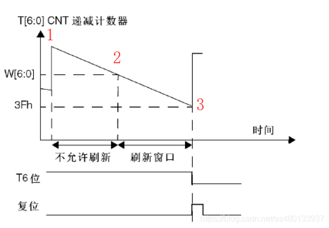

1计数器的初始值

2是我们设置的上窗口（W[6:0]值）

3是下窗口值(0x3F)

窗口看门狗计数器的值只有在2和3之间(上窗口和下窗口之间)才可以喂狗

窗口看门狗中断：

窗口看门狗如果使能了提前唤醒中断，系统出现问题，喂狗函数没有生效，那么在计数器由减到0x40(0x3f+1)的时候，便会先进入中断，之后才会复位，你也可以在中断里面喂狗。

WWDG超时时间计算公式：

$$Tout=\frac{4096*2^{(WDGTB)}*(T[5:0]+1)}{Fwwdg}$$

Tout是WWDG超时时间（没喂狗）
Fwwdg是WWDG的时钟源频率
4096是WWDG固定的预分频系数
2^WDGTB是WWDG_CFR寄存器设置的预分频系数值
T[5:0]是WWDG计数器低6位

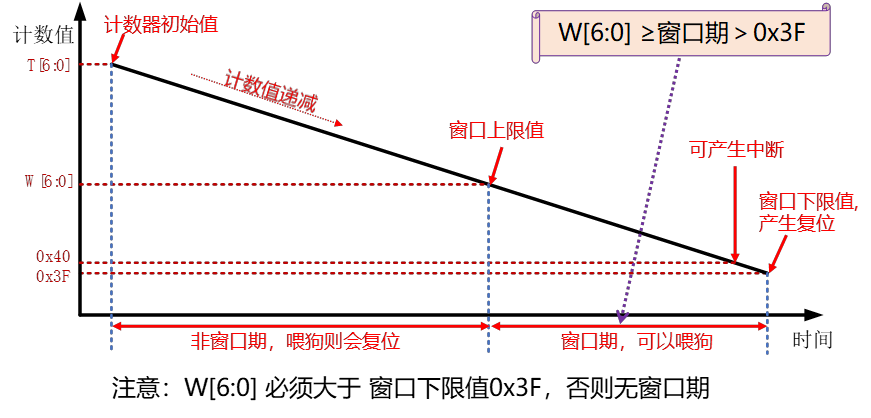

## 相关函数

**看门狗初始化（了解）**

```c
HAL_StatusTypeDef HAL_WWDG_Init( WWDG_HandleTypeDef * hwwdg ) 
```

**喂狗函数**

```c
HAL_StatusTypeDef HAL_WWDG_Refresh( WWDG_HandleTypeDef * hwwdg )
```

**看门狗中断处理函数**

```c
void HAL_WWDG_IRQHandler( WWDG_HandleTypeDef * hwwdg ) 
```

**看门狗中断回调函数**

```c
void HAL_WWDG_EarlyWakeupCallback( WWDG_HandleTypeDef * hwwdg ) 
```

# 基本定时器

## **SMT32F1系列共有8个定时器**

高级定时器（TIM1、TIM8）；通用定时器（TIM2、TIM3、TIM4、TIM5）；基本定时器（TIM6、TIM7）。

## **SMT32F4系列共有15个定时器**

高级定时器（TIM1、TIM8）；通用定时器（TIM2、TIM3、TIM4、TIM5、TIM9~TIM14）；基本定时器（TIM6、TIM7）。

## **定时器溢出时间计算公式**

$$Tout=\frac{(ARR+1)*(PSC+1)}{Ft}$$

| 定时器种类             | 位数 | 计数器模式        | 产生DMA请求 | 捕获/比较通道 | 互补输出 | 特殊应用场景                            |
| ---------------------- | ---- | ----------------- | ----------- | ------------- | -------- | --------------------------------------- |
| 高级定时器(TIM1,TIM8)  | 16   | 向上,向下,向上/下 | 可以        | 4             | 有       | 带可编程死区的互补输出                  |
| 通用定时器(TIM2,TIM5)  | 32   | 向上,向下,向上/下 | 可以        | 4             | 无       | 通用.定时计数,PWM输出,输入捕获,输出比较 |
| 通用定时器(TIM3,TIM4)  | 16   | 向上,向下,向上/下 | 可以        | 4             | 无       | 通用.定时计数,PWM输出,输入捕获,输出比较 |
| 通用定时器(TIM9~TIM14) | 16   | 向上              | 没有        | 2             | 无       | 通用.定时计数,PWM输出,输入捕获,输出比较 |
| 通用定时器(TIM6,TIM7)  | 16   | 向上,向下,向上/下 | 可以        | 0             | 无       | 主要应用于驱动DAC                       |

| 定时器类型 | 主要功能                                                     |
| ---------- | ------------------------------------------------------------ |
| 基本定时器 | 没有输入输出通道，常用作时基，即定时功能                     |
| 通用定时器 | 具有多路独立通道，可用于输入捕获/输出比较，也可用作时基      |
| 高级定时器 | 除具备通用定时器所有功能外，还具备带死区控制的互补信号输出、刹车输入等功能（可用于电机控制、数字电源设计等） |

## 基本定时器TIM6/TIM7

主要特性

16位递增计数器（计数值：0~65535）

16位预分频器（分频系数：1~65536）

可用于触发DAC

在更新事件（计数器溢出）时，会产生中断/DMA请求

## 函数讲解

### **启动定时器计数**

```c
HAL_TIM_Base_Start_IT(TIM_HandleTypeDef *htim);
```


### **定时器中断处理函数 （了解）**

```c
HAL_TIM_IRQHandler(TIM_HandleTypeDef *htim);
```

此函数在stm32f4xx_it.c的 TIM2_IRQHandler()定时器中断服务函数中被调用

这个函数的具体作用是判断中断是否正常，然后判断产生的是哪一类定时器中断(溢出中断/PWM中断.....)，然后进入相应的中断回调函数。

 

### **在中断回调函数中添加用户代码**

```c
__weak void HAL_TIM_PeriodElapsedCallback(TIM_HandleTypeDef *htim)
```

在HAL库中，每进行完一个中断，并不会立刻退出，而是会进入到中断回调函数中，

这里我们是使用定时器溢出中断回调函数

 

### **中断执行过程（了解）**

```c
void TIM3_IRQHandler(void)  首先进入中断函数
HAL_TIM_IRQHandler(&htim2);之后进入定时器中断处理函数，判断产生的是哪一类定时器中断(溢出中断/PWM中断.....) 和定时器通道
void HAL_TIM_PeriodElapsedCallback(&htim2);  进入相对应中断回调函数
```

# 通用定时器

## 介绍

通用定时器可以向上计数、向下计数、向上向下双向计数模式。

可用于触发DAC、ADC在更新事件、触发事件、输入捕获、输出比较时，会产生中断/DMA请求

4个独立通道，可用于：输入捕获、输出比较、输出PWM、单脉冲模式

使用外部信号控制定时器且可实现多个定时器互连的同步电路

支持编码器和霍尔传感器电路等

 

向上计数模式：计数器从0计数到自动加载值（TIMx_ARR），然后重新从0开始计数并且产生一个计数器溢出事件。

向下计数模式：计数器从自动装入的值（TIMx_ARR）开始向下计数到0，然后从自动装入的值重新开始，并产生一个计数器向下溢出事件。

中央对齐模式（向上/向下计数）：计数器从0开始计数到自动装入的值-1，产生一个计数器溢出事件，然后向下计数到1并且产生一个计数器溢出事件；然后再从0开始重新计数。

简单地理解三种计数模式，可以通过下面的图形：

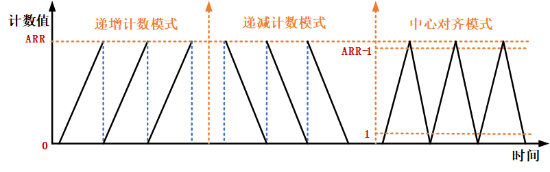

计数时钟的选择

计数器时钟可由下列时钟源提供：

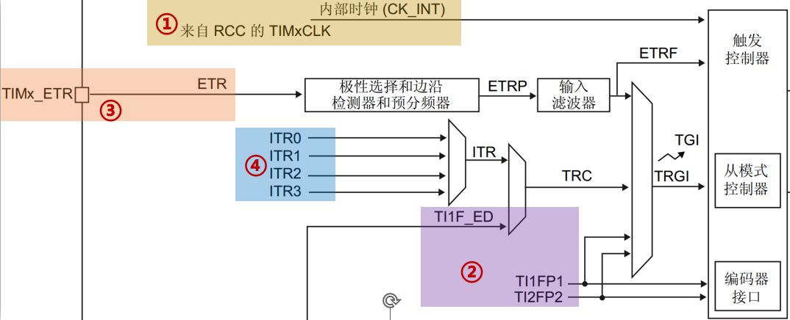


1. 内部时钟(CK_INT)，来自外设总线APB提供的时钟
2. 外部时钟模式1：外部输入引脚(TIx)，来自定时器通道1或者通道2引脚的信号
3. 外部时钟模式2：外部触发输入(ETR)，来自可以复用为TIMx_ETR的IO引脚
4. 内部触发输入(ITRx)，用于与芯片内部其它通用/高级定时器级联


## PWM

PWM原理讲解：下图为向上计数模式


在PWM输出模式下，除了CNT（计数器当前值）、ARR（自动重装载值）之外，还多了一个值CCRx（捕获/比较寄存器值）。

当CNT小于CCRx时，TIMx_CHx通道输出低电平；

当CNT等于或大于CCRx时，TIMx_CHx通道输出高电平。

PWM的一个周期

定时器从0开始向上计数

当0-t1段,定时器计数器TIMx_CNT值小于CCRx值,输出低电平

t1-t2段,定时器计数器TIMx_CNT值大于CCRx值,输出高电平

当TIMx_CNT值达到ARR时,定时器溢出,重新向上计数...循环此过程

至此一个PWM周期完成

总结：

每个定时器有四个通道,每一个通道都有一个捕获比较寄存器,

将寄存器值和计数器值比较,通过比较结果输出高低电平,便可以实现脉冲宽度调制模式（PWM信号）

TIMx_ARR寄存器确定PWM频率，

TIMx_CCRx寄存器确定占空比

详解：

若配置脉冲计数器TIMx_CNT为向上计数，而重载寄存器TIMx_ARR配置为N，即TIMx_CNT的当前计数值数值X在TIMxCLK时钟源的驱动下不断累加，当TIMx_CNT的数值X大于N时，会重置TIMx_CNT数值为0重新计数。

而在TIMxCNT计数的同时，TIMxCNT的计数值X会与比较寄存器TIMx_CCR预先存储了的数值A进行比较，当脉冲计数器TIMx_CNT的数值X小于比较寄存器TIMx_CCR的值A时，输出高电平（或低电平），相反地，当脉冲计数器的数值X大于或等于比较寄存器的值A时，输出低电平（或高电平）。

如此循环，得到的输出脉冲周期就为重载寄存器TIMx_ARR存储的数值(N+1)乘以触发脉冲的时钟周期，其脉冲宽度则为比较寄存器TIMx_CCR的值A乘以触发脉冲的时钟周期，即输出PWM的占空比为A/(N+1)。

PWM的工作模式：

PWM模式1(向上计数) :计数器从0计数加到自动重装载值(TIMx_ARR)，然后重新从0开始计数，并且产生一个计数器溢出事件  

PWM模式2(向下计数) :计数器从自动重装载值(TIMx_ARR)减到0，然后重新从重装载值(TIMx_ARR)开始递减，并且产生一个计数器溢出事件  

设置寄存器TIMx_CCMR1的OC1M[2:0]位来确定PWM的输出模式：

PWM模式1：在向上计数时，一旦TIMx_CNT<TIMx_CCR1时通道1为有效电平，否则为无效电平；在向下计数时，一旦TIMx_CNT>TIMx_CCR1时通道1为无效电平(OC1REF=0)，否则为有效电平(OC1REF=1)。

PWM模式2：在向上计数时，一旦TIMx_CNT<TIMx_CCR1时通道1为无效电平，否则为有效电平；在向下计数时，一旦TIMx_CNT>TIMx_CCR1时通道1为有效电平，否则为无效电平。 

 在两种模式下TIMx_CNT(计数器当前值)与TIMx_CCR1(捕获/比较值)  只是决定是有效电平还是无效电平  

 有效电平可以是高电平也可以是低电平，这需要结合CCER寄存器的CC1P位的值来确定。

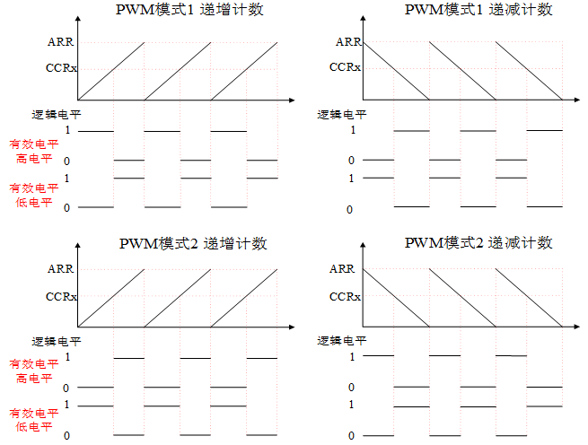

PWM模式1：

递增：CNT < CCRx，输出有效电平

CNT >= CCRx，输出无效电平

递减：CNT > CCRx，输出无效电平

CNT <= CCRx，输出有效电平

PWM模式2：

递增：CNT < CCRx，输出无效电平

CNT >= CCRx，输出有效电平

递减：CNT > CCRx，输出有效电平

CNT <= CCRx，输出无效电平

有/无效状态由TIMx_CCER决定

CCxP=0：OCx高电平有效

CCxP=1：Ocx低电平有效

$$Tout=\frac{(ARR+1*(PSC+1))}{Ft}$$

## 输入捕获

输入捕获概念：输入捕获模式可以用来测量脉冲宽度或者测量频率。STM32的定时器，除了TIM6、TIM7，其他的定时器都有输入捕获的功能。

输入捕获的工作原理：

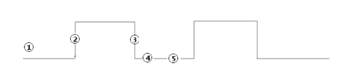

①先设置输入捕获为上升沿检测，

②记录发生上升沿时TIMx_CNT(计数器)的值

③配置捕获信号为下降沿捕获，当下降沿到来的时候发生捕获

④记录此时的TIMx_CN(计数器)T的值

⑤前后两次TIMx_CNT(计数器)的值之差就是高电平的脉宽。同时根据TIM的计数频率，我们就能知道高电平脉宽的准确时间。

简单说：

当你设置的捕获开始的时候，cpu会将计数寄存器的值复制到捕获比较寄存器中并开始计数，当再次捕捉到电平变化时，这是计数寄存器中的值减去刚才复制的值就是这段电平的持续时间，你可以设置上升沿捕获、下降沿捕获、或者上升沿下降沿都捕获，以捕获测量高电平脉宽为例

假设：递增计数模式

ARR：自动重装载寄存器的值

CCRx1：t1时间点CCRx的值

CCRx2：t2时间点CCRx的值

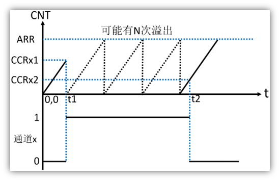

高电平期间，计时器计数的个数：N * (ARR+1) + CCRx2

## 脉冲计数

待定……

# 高级定时器

## 介绍

16位递增、递减、中心对齐计数器（计数值：0~65535）

16位预分频器（分频系数：1~65536）

可用于触发DAC、ADC

在更新事件、触发事件、输入捕获、输出比较时，会产生中断/DMA请求

4个独立通道，可用于：输入捕获、输出比较、输出PWM、单脉冲模式

使用外部信号控制定时器且可实现多个定时器互连的同步电路

支持编码器和霍尔传感器电路等

重复计数器

死区时间带可编程的互补输出

断路输入，用于将定时器的输出信号置于用户可选的安全配置中

## 输出指定个数PWM

计数器每次上溢或下溢都能使重复计数器减1，减到0时，再发生一次溢出就会产生更新事件

如果设置RCR为N，

更新事件将在N+1

次溢出时发生

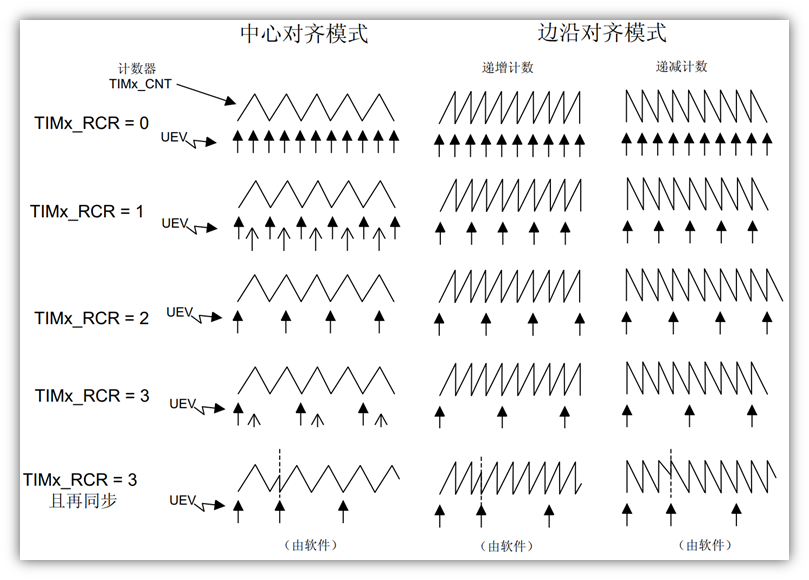

## 输出比较模式

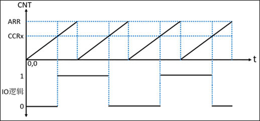

输出比较模式：翻转

当CNT = CCRx，OCxREF电平翻转

总结：PWM波周期或频率由ARR决定，占空比固定50%，相位由CCRx决定


## 互补输出带死区控制

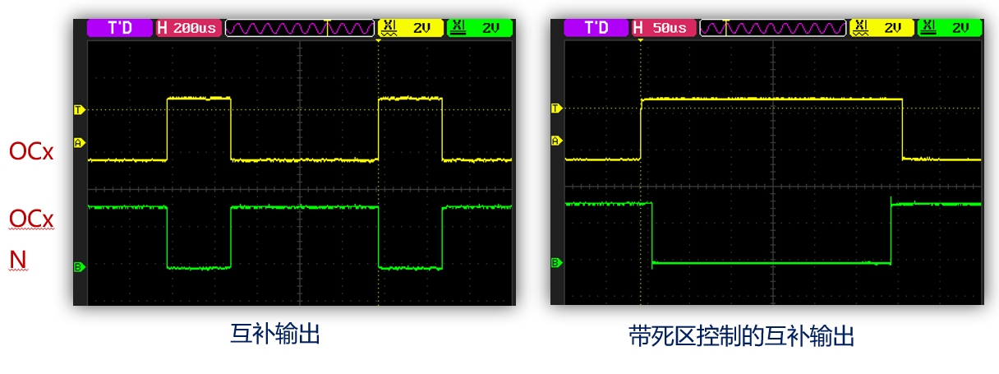

带死区控制的互补输出应用之H桥

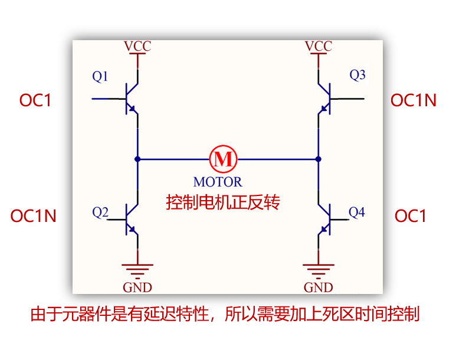

# DMA

## 什么是DMA

### DMA介绍

DMA（Direct Memory Access）直接存储器存取，为CPU减负

DMA传输：将数据从一个地址空间复制到另一个地址空间。

DMA传输无需CPU直接控制传输，也没有中断处理方式那样保留现场和恢复现场过程，通过硬件为RAM和IO设备开辟一条直接传输数据的通道，使得CPU的效率大大提高。

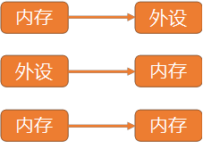

### STM32上的DMA资源：

12个独立可配置的通道： DMA1（7个通道）， DMA2（5个通道）

注意：DMA2仅存在大容量产品和互联型产品

每个通道都支持软件触发和特定的硬件触发

STM32F103C8T6 DMA资源：DMA1（7个通道）

### **STM32F1 DMA框图**

①DMA请求

DMA传输数据，先向DMA控制器发送请求

②DMA通道  

不同外设向DMA的不同通道发送请求

DMA1有7个通道，DMA2有5个通道

③DMA优先级

多个DMA通道同时发来请求时，就有先后响应处理的顺序问题，这个由仲裁器管理

（优先级管理也分软件阶段和硬件阶段）

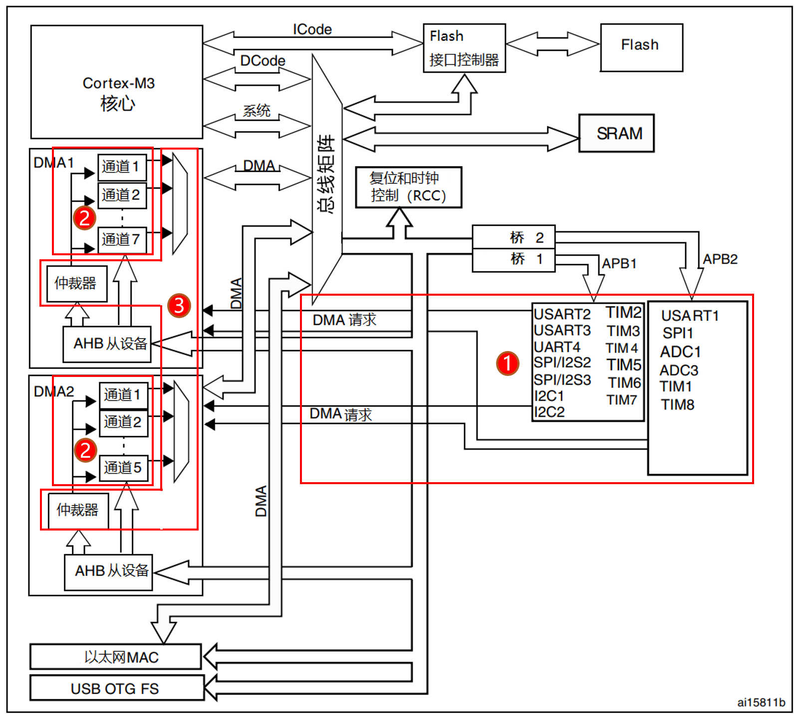

### DMA处理过程：

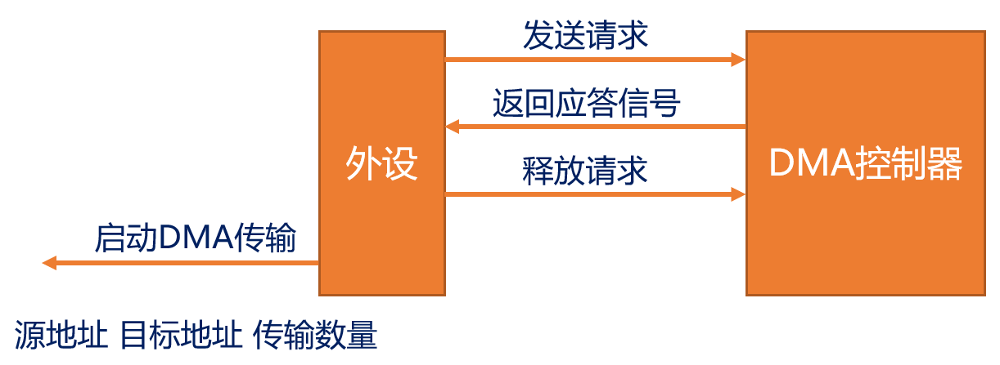

外设想通过DMA发送数据，先发送请求

DMA控制器收到请求后，给外设一个ack

外设收到ack后，释放请求

外设启动DMA数据传输，直至传输结束

### DMA1通道：

| 外设      | 通道1    | 通道2     | 通道3                 | 通道4                                 | 通道5       | 通道6                   | 通道7                  |
| --------- | -------- | --------- | --------------------- | ------------------------------------- | ----------- | ----------------------- | ---------------------- |
| ADC1      | ADC1     |           |                       |                                       |             |                         |                        |
| SPI/I^2^S |          | SPI1_RX   | SPI1_TX               | SPI/I2S2_RX                           | SPI/I2S2_TX |                         |                        |
| USART     |          | USART3_TX | USART3_RX             | USART1_TX                             | USART1_RX   | USART2_RX               | USART2_TX              |
| I^2^C     |          |           |                       | I2C2_TX                               | I2C2_RX     | I2C1_TX                 | I2C1_RX                |
| TIM1      |          | TIM1_CH1  | TIM1_CH2              | TIM1_TX4<br />TIM1_TRIG<br />TIM1_COM | TIM1_UP     | TIM1_CH3                |                        |
| TIM2      | TIM2_CH3 | TIM2_UP   |                       |                                       | TIM2_CH1    |                         | TIM1_CH2<br />TIM2_CH4 |
| TIM3      |          | TIM3_CH3  | TIM3_CH4<br />TIM3_UP |                                       |             | TIM3_CH1<br />TIM3_TRIG |                        |
| TIM4      | TIM4_CH1 |           |                       | TIM4_CH2                              | TIM_CH3     |                         | TIM4_UP                |

每个通道用来管理来自于一个或多个外设对存储器访问的请求。且都有一个仲裁器，用于处理DMA请求间的优先级。

### 仲裁器

​	仲裁器的作用是确定各个DMA传输的优先级
​	仲裁器根据通道请求的优先级来启动外设/存储器的访问。

### DMA优先级：

​	仲裁器管理DMA通道请求分为两个阶段：软件阶段(1)、硬件阶段(2)
​	第一阶段（软件阶段）：每个通道的优先级可在DMA_CCRx寄存器中设置，有四个等级：最高、高、中和低优先级。
​	第二阶段（硬件阶段）：如果两个请求有相同软件优先级，较低编号的通道比较高编号的通道有较高的优先级。
​	（大容量芯片中，DMA1控制器拥有高于DMA2控制器的优先级）
​	注意：多个请求通过逻辑或输入到DMA控制器，只能有一个请求有效。

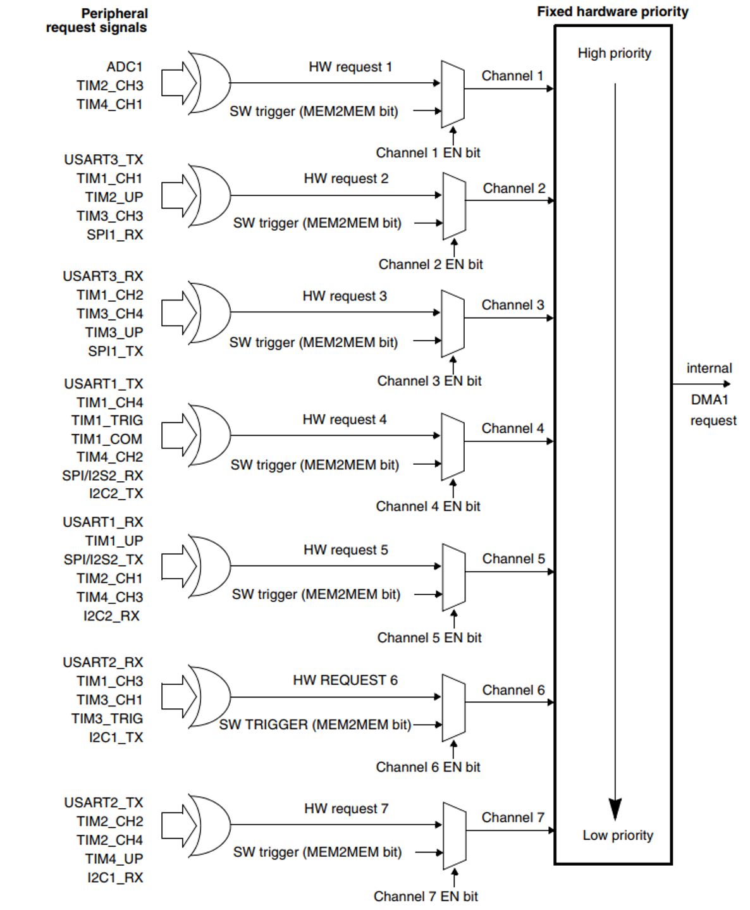

### DMA传输方式：

​	方法1：DMA_Mode_Normal，正常模式，
​	当一次DMA数据传输完后，停止DMA传送 ，也就是只传输一次
​	方法2：DMA_Mode_Circular ，循环传输模式
​	当传输结束时，硬件自动会将传输数据量寄存器进行重装，进行下一轮的数据传输。 也就是多次传输模式

### DMA中断

​	每个DMA通道都可以在DMA传输过半、传输完成和传输错误时产生中断。为应用的灵活性考虑，通过设置寄存器的不同位来打开这些中断。

## 驱动函数

| **驱动函数**                     | **功能描述**          |
| -------------------------------- | --------------------- |
| **__HAL_RCC_DMAx_CLK_ENABLE(…)** | 使能DMAx时钟          |
| **HAL_DMA_Init(…)**              | 初始化DMA             |
| **HAL_DMA_Start_IT(…)**          | 开始DMA传输           |
| **__HAL_LINKDMA(…)**             | 用来连接DMA和外设句柄 |
| **HAL_UART_Transmit_DMA(…)**     | 使能DMA发送，启动传输 |
| **__HAL_DMA_GET_FLAG(…)**        | 查询DMA传输通道的状态 |
| **__HAL_DMA_ENABLE(…)**          | 使能DMA外设           |
| **__HAL_DMA_DISABLE(…)**         | 失能DMA外设           |

## 相关结构体

DMA外设相关结构体：DMA_HandleTypeDef 和 DMA_InitTypeDef

```c
typedef struct 
{ 
	DMA_Channel_TypeDef    *Instance
	DMA_InitTypeDef         Init
} DMA_HandleTypeDef;

typedef struct 
{ 
	uint32_t Direction            /* DMA传输方向 */
	uint32_t PeriphInc            /* 外设地址(非)增量 */
	uint32_t MemInc            /* 存储器地址(非)增量*/
	uint32_t PeriphDataAlignment    /* 外设数据宽度 */
	uint32_t MemDataAlignment    /* 存储器数据宽度 */
	uint32_t Mode                /* 操作模式 */
	uint32_t Priority                /* DMA通道优先级 */
}DMA_InitTypeDef;
```

## 相关函数

初始化函数

```c
HAL_StatusTypeDef HAL_DMA_Init(DMA_HandleTypeDef *hdma);
HAL_StatusTypeDef HAL_UART_DMAStop(UART_HandleTypeDef *huart); /* 停止 */
HAL_StatusTypeDef HAL_UART_DMAPause(UART_HandleTypeDef *huart); /* 暂停 */
HAL_StatusTypeDef HAL_UART_DMAResume(UART_HandleTypeDef *huart); /* 恢复 */
void HAL_UART_TxCpltCallback(UART_HandleTypeDef *huart); /* 发送完成回调函数 */
void HAL_UART_TxHalfCpltCallback(UART_HandleTypeDef *huart);/* 发送一半回调函数 */
void HAL_UART_RxCpltCallback(UART_HandleTypeDef *huart); /* 接收完成回调函数 */
void HAL_UART_RxHalfCpltCallback(UART_HandleTypeDef *huart);/* 接收一半回调函数 */
void HAL_UART_ErrorCallback(UART_HandleTypeDef *huart); /* 传输出错回调函数 */
```

查询 DMA 传输状态。

在 DMA 传输过程中，我们要查询 DMA 传输通道的状态，使用的方法是通过检测 DMA 寄存器的相关位实现：

```c
__HAL_DMA_GET_FLAG(&g_dma_handle, DMA_FLAG_TCIF3_7);
```

获取当前传输剩余数据量：

```c
__HAL_DMA_GET_COUNTER(&g_dma_handle);
```

同样，我们也可以设置对应的 DMA 数据流传输的数据量大小，函数为：

```c
__HAL_DMA_SET_COUNTER (&g_dma_handle, 1000);
```

**启动使用 DMA 传输函数**

```c
HAL_Status TypeDef HAL_DMA_Start(DMA_HandleTypeDef *hdma,uint32_t SrcAddress, uint32_t DstAddress, uint32_t DataLength);
```

函数描述：

用于启动使用 DMA 传输，DMA1 和 DMA2 都是用的这个函数。

函数形参：

形参 1 是 DMA_HandleTypeDef 结构体类型指针变量。

形参 2 是 DMA 传输的源地址。

形参 3 是 DMA 传输的目的地址。

形参 4 是要传输的数据项数目。

## DMA库函数配置过程

1、使能DMA时钟：RCC_AHBPeriphClockCmd();

2、初始化DMA通道：DMA_Init();//设置通道；传输地址；传输方向；传输数据的数目；传输数据宽度；传输模式；优先级；是否开启存储器到存储器。

3、使能外设DMA；

4、使能DMA通道传输；

5、查询DMA传输状态。

# ADC

## 什么是ADC

ADC，全称：Analog-to-Digital Converter，指模拟/数字转换器


ADC可以将引脚上连续变化的模拟电压转换为内存中存储的数字变量，建立模拟电路到数字电路的桥梁。

输入电压范围：0~3.3V

18个输入通道，可测量16个外部和2个内部信号源

规则组和注入组两个转换单元

模拟看门狗自动监测输入电压范围

STM32F103C8T6 ADC资源：ADC1、ADC2，10个外部输入通道

基本结构：

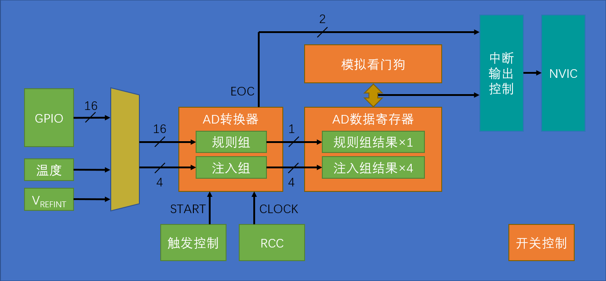

## ADC的转换模式

1 单次转换模式：ADC只执行一次转换；

2 连续转换模式：转换结束之后马上开始新的转换；

3 扫描模式：ADC扫描被规则通道和注入通道选中的所有通道，在每个组的每个通道上执行单次转换。在每个通道转换结束时，这一组的下一个通道被自动转换。如果设置了CONT位（开启了连续 转换模式），转换不会在选择组的最后一个通道上停止，而是再次从选择组的第一个通道继续转换。

 

扫描模式简单的说是一次对所有所选中的通道进行转换，比如开了ch0，ch1，ch4，ch5。 ch0转换完以后就会自动转换通道1,4,5直到转换完，这个过程不能被打断。如果开启了连续转换模式，则会在转换完ch5之后开始新一轮的转换。

这就引入了间断模式，可以说是对扫描模式的一种补充。它可以把0,1,4,5这四个通道进行分组。可以分成0,1一组，4,5一组。也可以每个通道单独配置为一组。这样每一组转换之前都需要先触发一次。

ADC单通道：

只进行一次ADC转换：配置为“单次转换模式”，扫描模式关闭。ADC通道转换一次后，就停止转换。等待再次使能后才会重新转换

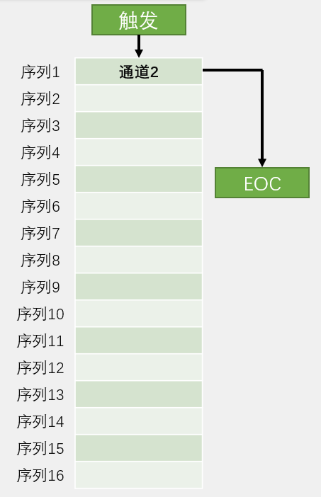

进行连续ADC单通道转换：

配置为“连续转换模式”，扫描模式关闭。ADC通道转换一次后，接着进行下一次转换，不断连续。


ADC多通道：

只进行一次ADC转换：配置为“单次转换模式”，扫描模式使能。ADC的多个通道，按照配置的顺序依次转换一次后，就停止转换。等待再次使能后才会重新转换

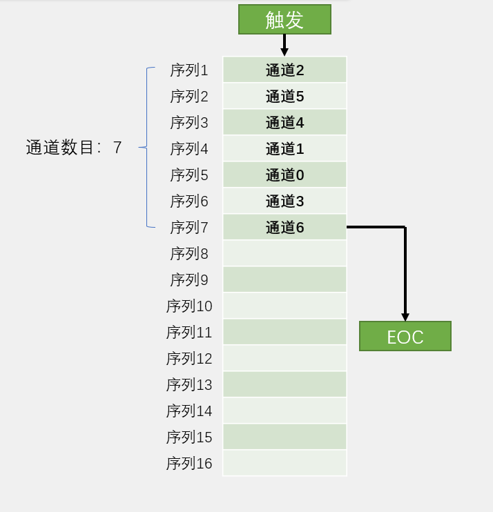

进行连续ADC多通道转换：

配置为“连续转换模式”，扫描模式使能。ADC的多个通道，按照配置的顺序依次转换一次后，接着进行下一次转换，不断连续。

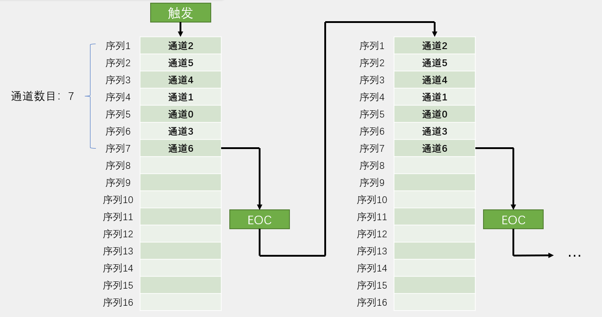

也就是：多通道必须使能扫描模式

## ADC框图简介

ADC框图简介（F1）

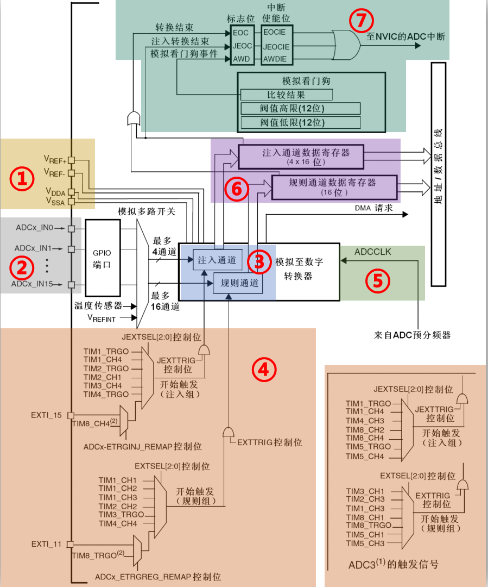

①参考电压/模拟部分电压
②输入通道
③转换序列
④触发源
⑤转换时间
⑥数据寄存器
⑦中断

ADC框图简介（F4）

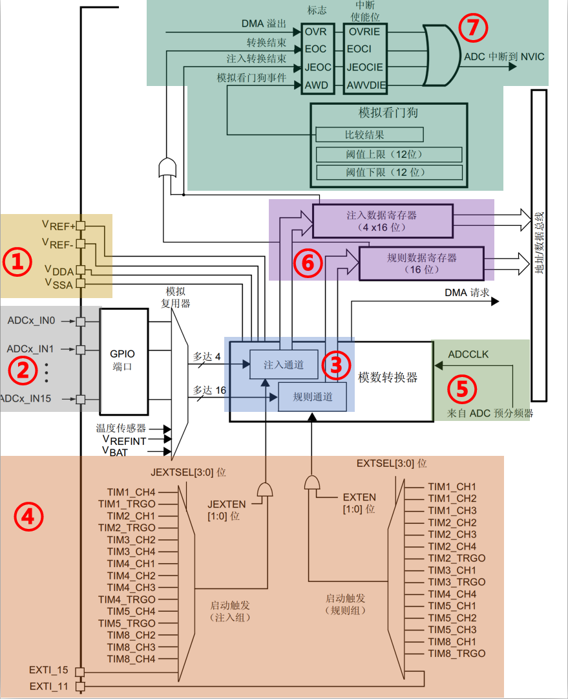

①参考电压/模拟部分电压
②输入通道
③转换序列
④触发源
⑤转换时间
⑥数据寄存器
⑦中断

## 输入通道

ADC输入通道（F1）

从ADCx_INT0-ADCx_INT15 对应三个ADC的16个外部通道，进行模拟信号转换。此外，还有两个内部通道：温度检测或者内部电压检测

选择对应通道之后，便会选择对应GPIO引脚，相关的引脚定义和描述可在开发板的数据手册里找

| **ADC1** | **IO**             | **ADC2** | **IO**      | **ADC3** | **IO**      |
| -------- | ------------------ | -------- | ----------- | -------- | ----------- |
| 通道0    | PA0                | 通道0    | PA0         | 通道0    | PA0         |
| 通道1    | PA1                | 通道1    | PA1         | 通道1    | PA1         |
| 通道2    | PA2                | 通道2    | PA2         | 通道2    | PA2         |
| 通道3    | PA3                | 通道3    | PA3         | 通道3    | PA3         |
| 通道4    | PA4                | 通道4    | PA4         | 通道4    | PF6         |
| 通道5    | PA5                | 通道5    | PA5         | 通道5    | PF7         |
| 通道6    | PA6                | 通道6    | PA6         | 通道6    | PF8         |
| 通道7    | PA7                | 通道7    | PA7         | 通道7    | PF9         |
| 通道8    | PB0                | 通道8    | PB0         | 通道8    | PF10        |
| 通道9    | PB1                | 通道9    | PB1         | 通道9    | 连接内部VSS |
| 通道10   | PC0                | 通道10   | PC0         | 通道10   | PC0         |
| 通道11   | PC1                | 通道11   | PC1         | 通道11   | PC1         |
| 通道12   | PC2                | 通道12   | PC2         | 通道12   | PC2         |
| 通道13   | PC3                | 通道13   | PC3         | 通道13   | PC3         |
| 通道14   | PC4                | 通道14   | PC4         | 通道14   | 连接内部VSS |
| 通道15   | PC5                | 通道15   | PC5         | 通道15   | 连接内部VSS |
| 通道16   | 连接内部温度传感器 | 通道16   | 连接内部VSS | 通道16   | 连接内部VSS |
| 通道17   | 连接内部Vrefint    | 通道17   | 连接内部VSS | 通道17   | 连接内部VSS |

注入通道与规则通道

我们看到，在选择了ADC的相关通道引脚之后，在模拟至数字转换器中有两个通道，注入通道，规则通道，规则通道至多16个，注入通道至多4个

规则通道：

规则通道相当于你正常运行的程序，看它的名字就可以知道，很规矩，就是正常执行程序

注入通道：

注入通道可以打断规则通道，听它的名字就知道不安分，如果在规则通道转换过程中，有注入通道进行转换，那么就要先转换完注入通道，等注入通道转换完成后，再回到规则通道的转换流程。

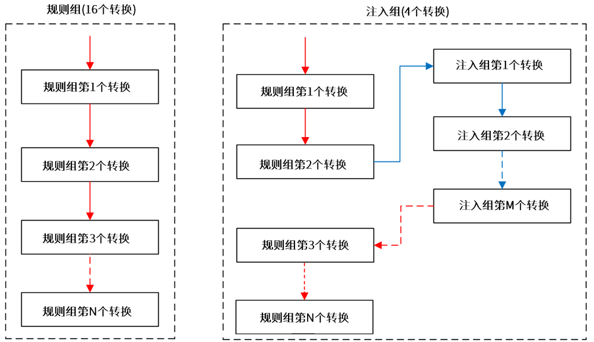

## ADC外设在CubeMX上的参数配置界面


间断模式，不是循环模式

## 相关函数

### ADC 的初始化函数 (了解)

```c
HAL_StatusTypeDef HAL_ADC_Init(ADC_HandleTypeDef *hadc);
```

### ADC 的自校准函数 (了解)

```c
HAL_StatusTypeDef HAL_ADCEx_Calibration_Start(ADC_HandleTypeDef *hadc);
```

首先调用 HAL_ADC_Init 函数配置了相关的功能后，再调用此函数进行 ADC 自校准功能。

### ADC 通道配置函数

```c
HAL_StatusTypeDef HAL_ADC_ConfigChannel(ADC_HandleTypeDef *hadc,ADC_ChannelConfTypeDef *sConfig);
```

调用 HAL_ADC_Init 函数配置了相关的功能后，就可以调用此函数进行 ADC 自校准功能。

函数形参：

​	形参 1 是 ADC_HandleTypeDef 结构体类型指针变量。

​	形参 2 是 ADC_ChannelConfTypeDef 结构体类型指针变量，用于配置 ADC 采样时间，使

用的通道号，单端或者差分方式的配置等。该结构体定义如下：

```c
typedef struct {
    uint32_t Channel;  /* ADC 转换通道*/
    uint32_t Rank;  /* ADC 转换顺序 */
    uint32_t SamplingTime; /* ADC 采样周期 */
    uint32_t Offset; /* ADC 偏移量 */
} ADC_ChannelConfTypeDef;
```

1. Channel：ADC 转换通道，范围：0~19。
2. Rank：在常规转换中的常规组的转换顺序，可以选择 1~16。
3. SamplingTime：ADC 的采样周期，最大 480 个 ADC 时钟周期，要求采样周期尽量大，以减少误差。

### 启动 ADC 函数

```c
HAL_StatusTypeDef HAL_ADC_Start(ADC_HandleTypeDef *hadc);
```

 启用中断并启动常规通道的ADC转换。

```c
HAL_StatusTypeDef HAL_ADC_Start_IT(ADC_HandleTypeDef* hadc);
```

### 启动 ADC（DMA 传输）方式函数

```c
HAL_StatusTypeDef HAL_ADC_Start_DMA(ADC_HandleTypeDef* hadc,uint32_t *pData, uint32_t Length);
```

形参 1 是 ADC_HandleTypeDef 结构体类型指针变量。

形参 2 是 ADC 采样数据传输的目的地址。

形参 3 是要传输的数据项数目。

注意事项：

HAL_ADC_Start_DMA 和 HAL_DMA_Start 都是配置并启动 DMA 函数，区别是：

HAL_ADC_Start_DMA 比较局限性，只是用于启动 ADC 的数据传输。HAL_DMA_Start 则适用

性较广泛，任何能使用 DMA 传输的场景都可以用该函数启动。实际应用中看个人的需求选择

用哪个函数。在例程中我们使用的是 HAL_DMA_Start 函数。如果我们需要使用 DMA 中断，我

们还可以使用 HAL_DMA_Start_IT 函数，使能了 DMA 全部的中断。

### 等待 ADC 规则组转换完成函数

```c
HAL_StatusTypeDef HAL_ADC_PollForConversion(ADC_HandleTypeDef *hadc,uint32_t Timeout);
```

一般先调用 HAL_ADC_Start 函数启动转换，再调用该函数等待转换完成，然后再调用HAL_ADC_GetValue 函数来获取当前的转换值。

形参 1 是 ADC_HandleTypeD.ef 结构体类型指针变量。

形参 2 是等待转换的等待时间，单位：毫秒 ms。

### 获取规则组 ADC 转换值函数

```c
uint32_t HAL_ADC_GetValue(ADC_HandleTypeDef *hadc);
```

一般先调用 HAL_ADC_Start 函数启动转换，再调用 HAL_ADC_PollForConversion 函数等

待转换完成，然后再调用 HAL_ADC_GetValue 函数来获取当前的转换值。

### 禁用ADC并停止常规通道的转换。

```c
HAL_StatusTypeDef HAL_ADC_Stop(ADC_HandleTypeDef* hadc);
```

### 禁用ADC DMA（单ADC模式）并禁用ADC外围设备。

```c
HAL_StatusTypeDef HAL_ADC_Stop_DMA(ADC_HandleTypeDef* hadc);
```

### 禁用常规通道的中断和停止ADC转换

```c
HAL_StatusTypeDef HAL_ADC_Stop_IT(ADC_HandleTypeDef* hadc);
```

### 常规转换在非阻塞模式下完成回调

```c
void HAL_ADC_ConvCpltCallback(ADC_HandleTypeDef* hadc);
```

### 非阻塞模式下的常规转换半DMA传输回调

```c
void HAL_ADC_ConvHalfCpltCallback(ADC_HandleTypeDef* hadc);
```

### 看门狗配置 (了解)

```c
HAL_StatusTypeDef HAL_ADC_AnalogWDGConfig(ADC_HandleTypeDef *hadc , ADC_AnalogWDGConfTypeDef *AnalogWDGConfig);
```

功能：配置模拟看门狗。

注意：模拟看门狗阈值可以在ADC转换过程中进行修改。在这种情况下，必须考虑一些限制：编程阈值从下一个ADC EOC（酉转换结束）开始生效。考虑到寄存器写入延迟可能由于总线活动而发生，这可能会导致新编程阈值的有效时序的不确定性。

参数：

​	指向ADC_HandleTypeDef结构的hadc指针，该结构包含指定ADC的配置信息。

​	指向ADC_AnalogWDGConfTypeDef结构的AnalogWDGC配置指针，该结构包含ADC模拟看门狗的配置信息。

返回值：HAL状态

## 其他功能

### **ADC时钟**

图中的ADC预分频器的ADCCLK是ADC模块的时钟来源。通常，由时钟控制器提供的ADCCLK时钟和PCLK2（APB2时钟）同步。RCC控制器为ADC时钟提供一个专用的可编程预分频器。 分频因子由RCC_CFGR的ADCPRE[1:0]配置，可配置2/4/6/8分频

STM32的ADC最大的转换速率为1MHz,也就是说最快转换时间为1us，为了保证ADC转换结果的准确性，ADC的时钟最好不超过14M。

T = 采样时间 + 12.5个周期，其中1周期为1/ADCCLK

例如，当 ADCCLK=14Mhz 的时候，并设置 1.5 个周期的采样时间，则得到： Tcovn=1.5+12.5=14 个周期=1us。

### **外部触发转换**

ADC 转换可以由ADC 控制寄存器2: ADC_CR2 的ADON 这个位来控制，写1 的时候开始转换，写0 的时候停止转换

当然，除了ADC_CR2寄存器的ADON位控制转换的开始与停止，还可以支持外部事件触发转换（比如定时器捕捉、EXTI线）

包括内部定时器触发和外部IO触发。具体的触发源由ADC_CR2的EXTSEL[2:0]位（规则通道触发源 ）和 JEXTSEL[2:0]位（注入通道触发源）控制。

同时ADC3的触发源与ADC1/2的触发源有所不同，上图已经给出，

具体查看第五部分框图即可理解

### **中断**

中断触发条件有三个，规则通道转换结束，注入通道转换结束，或者模拟看门狗状态位被设置时都能产生中断，

转换结束中断就是正常的ADC完成一次转换，进入中断，这个很好理解

### **模拟看门狗中断**

当被ADC转换的模拟电压值低于低阈值或高于高阈值时，便会产生中断。阈值的高低值由ADC_LTR和ADC_HTR配置

模拟看门狗，听他的名字就知道，在ADC的应用中是为了防止读取到的电压值超量程或者低于量程

### **DMA**

同时ADC还支持DMA触发，规则和注入通道转换结束后会产生DMA请求，用于将转换好的数据传输到内存。

注意，只有ADC1和ADC3可以产生DMA请求

# DAC

## 什么是DAC

### DAC简介

全称：Digital-to-Analog Converter，指数字/模拟转换器，ADC和DAC是模拟电路与数字电路之间的桥梁

### DAC的特性参数

分辨率：表示模拟电压的最小增量，常用二进制位数表示，比如：8、12位等

建立时间 ：表示将一个数字量转换为稳定模拟信号所需的时间

精度：转换器实际特性曲线与理想特性曲线之间的最大偏差

误差源：比例系统误差、失调误差、非线性误差。

​	原因：元件参数误差、基准电压不稳定、运算放大器零漂等

### DAC数据格式

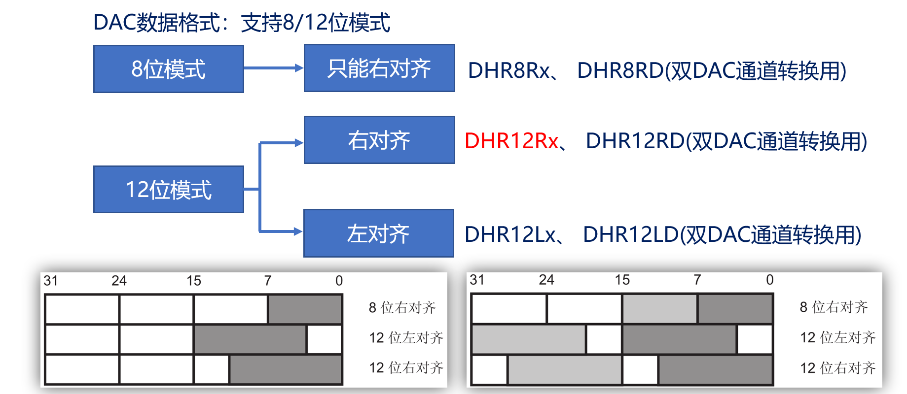

## DAC触发方式

三种触发方式：自动触发、软件触发、外部事件触发。

## 相关函数

### 开启DAC输出

```c
HAL_StatusTypeDef HAL_DAC_Start(DAC_HandleTypeDef* hdac, uint32_t Channel);  
```

### 关闭DAC输出

```c
HAL_StatusTypeDef HAL_DAC_Stop(DAC_HandleTypeDef* hdac, uint32_t Channel); 
```

### 开启DAC的DMA输出

```c
HAL_StatusTypeDef HAL_DAC_Start_DMA(DAC_HandleTypeDef* hdac, uint32_t Channel, uint32_t* pData, uint32_t Length, uint32_t Alignment); //需要函数中不断开启 
```

### 关闭DAC的DMA输出

```c
HAL_StatusTypeDef HAL_DAC_Stop_DMA(DAC_HandleTypeDef* hdac, uint32_t Channel); 
```

### 设置DAC输出值

```c
HAL_StatusTypeDef HAL_DAC_SetValue(DAC_HandleTypeDef* hdac, uint32_t Channel, uint32_t Alignment, uint32_t Data); 
```

### 获取DAC输出值

```c
uint32_t HAL_DAC_GetValue(DAC_HandleTypeDef* hdac, uint32_t Channel); 
```

在main()主函数中设置DAC输出的数据为12位右对齐，DAC输出为2048，并使能DAC1输出通道

```c
HAL_DAC_SetValue(&hdac, DAC_CHANNEL_1, DAC_ALIGN_12B_R, 2048);
HAL_DAC_Start(&hdac,DAC_CHANNEL_1);
```

###  设置DAC的输出值

```c
HAL_DAC_SetValue(&hdac, DAC_CHANNEL_1, DAC_ALIGN_12B_R, 2048);
```

参数一： DAC结构体名

参数二： 设置DAC通道

参数三： 设置DAC对齐方式

参数四： 设置输出电压值 12位最大位4095

### 开启DAC输出

```c
HAL_DAC_Start(&hdac,DAC_CHANNEL_1);
```

参数一： DAC结构体名

参数二： DAC通道

# IIC

## 什么是IIC

### IIC 简介

IIC(Inter-Integrated Circuit)总线是一种由 PHILIPS 公司开发的两线式串行总线，用于连接微 控制器以及其外围设备。它是由数据线 SDA 和时钟线 SCL 构成的串行总线，可发送和接收数 据，在 CPU 与被控 IC 之间、IC 与 IC 之间进行双向传送。 

### IIC 总线有如下特点：

①总线由数据线 SDA 和时钟线 SCL 构成的串行总线，数据线用来传输数据，时钟线用来 同步数据收发。

②总线上每一个器件都有一个唯一的地址识别，所以我们只需要知道器件的地址，根据时 序就可以实现微控制器与器件之间的通信。

③数据线 SDA 和时钟线 SCL 都是双向线路，都通过一个电流源或上拉电阻连接到正的电 压，所以当总线空闲的时候，这两条线路都是高电平。 

④总线上数据的传输速率在标准模式下可达 100kbit/s 在快速模式下可达 400kbit/s，在高速 模式下可达 3.4Mbit/s。

⑤总线支持设备连接。在使用 IIC 通信总线时，可以有多个具备 IIC 通信能力的设备挂载 在上面，同时支持多个主机和多个从机，连接到总线的接口数量只由总线电容 400pF 的限制决 定。IIC 总线挂载多个器件的示意图，如下图所示：

PS： 这里要注意IIC是为了与低速设备通信而发明的，所以IIC的传输速率比不上SPI。

### IIC总线结构图

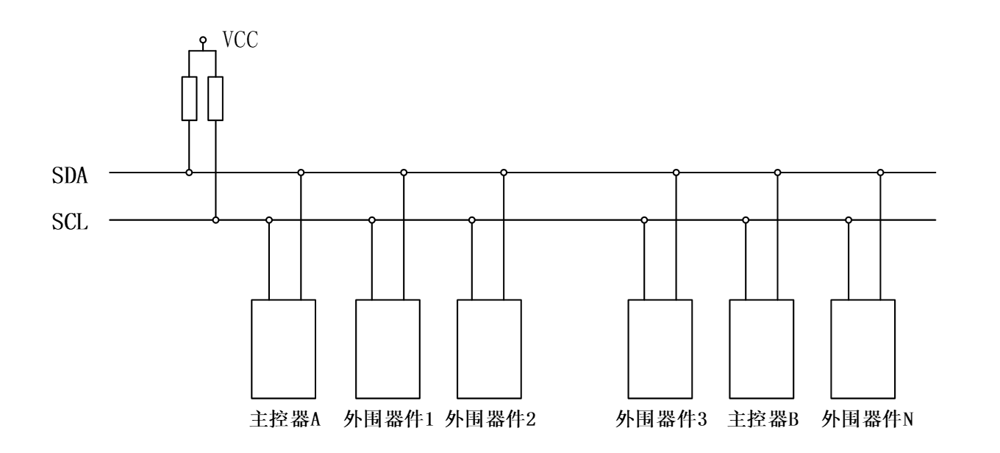

### IIC协议

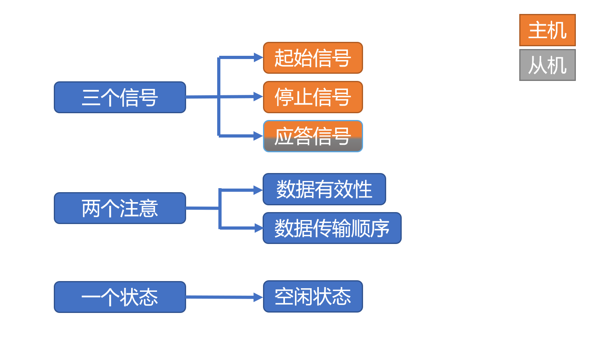

### IIC协议时序

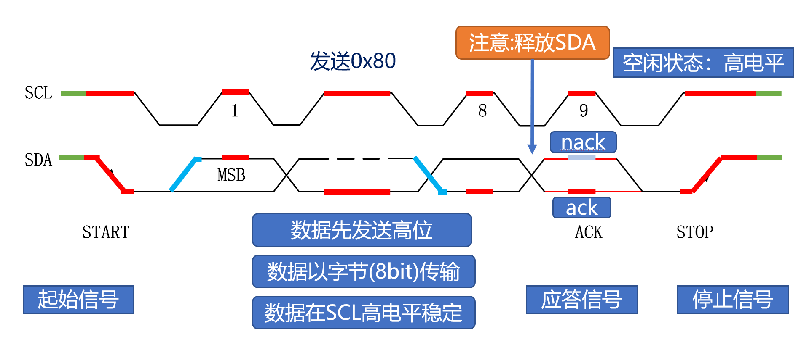

### IIC总线时序图

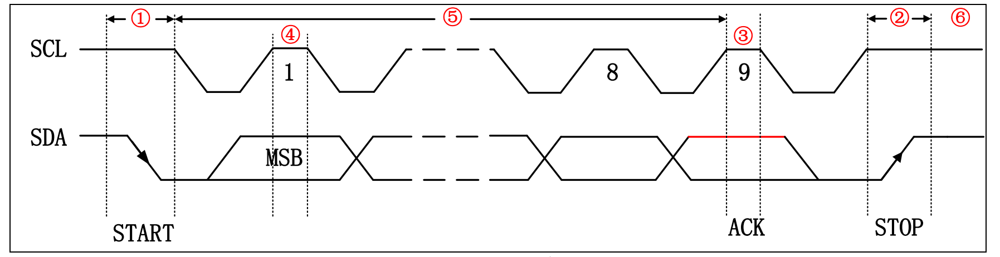

为了便于大家更好的了解 IIC 协议，我们从起始信号、停止信号、应答信号、数据有效性、 数据传输以及空闲状态等 6 个方面讲解，大家需要对应图中标号来理解。

① 起始信号当 SCL 为高电平期间，SDA 由高到低的跳变。起始信号是一种电平跳变时序信号，而不是一个电平信号。该信号由主机发出，在起始信号产生后，总线就处于被占用状态，准备数据传 输。 

② 停止信号 当 SCL 为高电平期间，SDA 由低到高的跳变。停止信号也是一种电平跳变时序信号，而不是一个电平信号。该信号由主机发出，在停止信号发出后，总线就处于空闲状态。 

③ 应答信号 发送器每发送一个字节，就在时钟脉冲 9 期间释放数据线，由接收器反馈一个应答信号。 应答信号为低电平时，规定为有效应答位（ACK 简称应答位），表示接收器已经成功地接收了 该字节；应答信号为高电平时，规定为非应答位（NACK），一般表示接收器接收该字节没有成功。 观察上图标号③就可以发现，有效应答的要求是从机在第 9 个时钟脉冲之前的低电平期间 将 SDA 线拉低，并且确保在该时钟的高电平期间为稳定的低电平。如果接收器是主机，则在它 收到最后一个字节后，发送一个 NACK 信号，以通知被控发送器结束数据发送，并释放 SDA 线，以便主机接收器发送一个停止信号。 

④ 数据有效性 IIC 总线进行数据传送时，时钟信号为高电平期间，数据线上的数据必须保持稳定，只有在 时钟线上的信号为低电平期间，数据线上的高电平或低电平状态才允许变化。数据在 SCL 的上 升沿到来之前就需准备好。并在下降沿到来之前必须稳定。 

⑤ 数据传输 在 I2C 总线上传送的每一位数据都有一个时钟脉冲相对应（或同步控制），即在 SCL 串行 时钟的配合下，在 SDA 上逐位地串行传送每一位数据。数据位的传输是边沿触发。 

⑥ 空闲状态 IIC 总线的 SDA 和 SCL 两条信号线同时处于高电平时，规定为总线的空闲状态。此时各个 器件的输出级场效应管均处在截止状态，即释放总线，由两条信号线各自的上拉电阻把电平拉高。

### IIC写操作通讯过程图

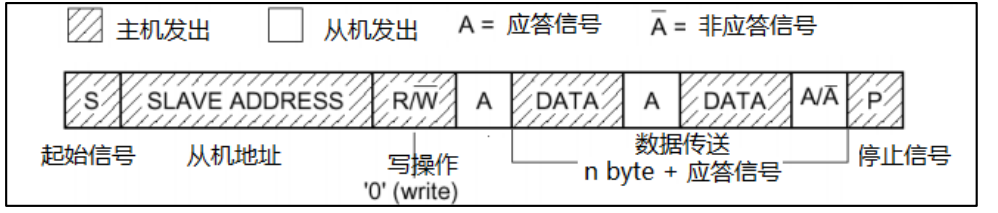

主机首先在 IIC 总线上发送起始信号，那么这时总线上的从机都会等待接收由主机发出的数据。主机接着发送从机地址+0(写操作)组成的 8bit 数据，所有从机接收到该 8bit 数据后，自行检验是否是自己的设备的地址，假如是自己的设备地址，那么从机就会发出应答信号。主机在总线上接收到有应答信号后，才能继续向从机发送数据。注意：IIC 总线上传送的数据信号是广义的，既包括地址信号，又包括真正的数据信号。

### IIC读操作通讯过程图

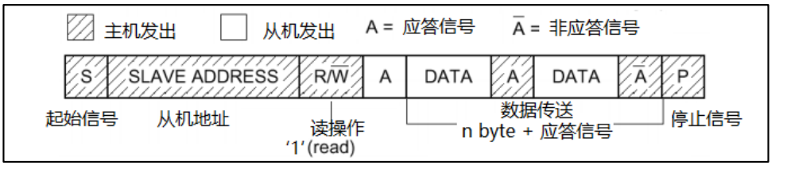

主机向从机读取数据的操作，一开始的操作与写操作有点相似，观察两个图也可以发现， 都是由主机发出起始信号，接着发送从机地址+1(读操作)组成的 8bit 数据，从机接收到数据验证是否是自身的地址。 那么在验证是自己的设备地址后，从机就会发出应答信号，并向主机返 回 8bit 数据，发送完之后从机就会等待主机的应答信号。假如主机一直返回应答信号，那么从机可以一直发送数据，也就是图中的（n byte + 应答信号）情况，直到主机发出非应答信号，从机才会停止发送数据。

## 相关函数

### IIC写数据

```c
HAL_I2C_Master_Transmit(I2C_HandleTypeDef *hi2c, uint16_t DevAddress, uint8_t *pData, uint16_t Size, uint32_t Timeout);
```

参数：

*hi2c 设置使用的是那个IIC 例：&hi2c2

DevAddress 写入的地址 设置写入数据的地址 例 0xA0

*pData 需要写入的数据

Size 要发送的字节数

Timeout 最大传输时间，超过传输时间将自动退出传输函数

### IIC读一个字节

```c
HAL_I2C_Master_Receive(I2C_HandleTypeDef *hi2c, uint16_t DevAddress, uint8_t *pData, uint16_t Size, uint32_t Timeout);
```

参数：

    *hi2c：设置使用的是那个IIC 例：&hi2c2
    DevAddress：写入的地址 设置写入数据的地址 例 0xA0
    *pData：存储读取到的数据
    Size：接收的字节数
    Timeout：最大读取时间，超过时间将自动退出读取函数

举例：

```c
HAL_I2C_Master_Transmit(&hi2c1,0xA1,(uint8_t*)TxData,2,1000) ;//发送两个字节数据
```

### IIC写数据函数

```c
HAL_I2C_Mem_Write(I2C_HandleTypeDef *hi2c, uint16_t DevAddress, uint16_t MemAddress, uint16_t MemAddSize, uint8_t *pData, uint16_t Size, uint32_t Timeout);
```

功能： IIC写多个数据 该函数适用于IIC外设里面还有子地址寄存器的设备，比方说E2PROM,除了设备地址，每个存储字节都有其对应的地址

参数：
    *hi2c： I2C设备号指针，设置使用的是那个IIC 例：&hi2c2
    DevAddress： 从设备地址 从设备的IIC地址 例E2PROM的设备地址 0xA0
    MemAddress： 从机寄存器地址 ，每写入一个字节数据，地址就会自动+1
    MemAddSize： 从机寄存器地址字节长度 8位或16位, 即写入数据的字节类型(8位还是16位) I2C_MEMADD_SIZE_8BIT 或者 I2C_MEMADD_SIZE_16BIT
    *pData： 需要写入的的数据的起始地址
    Size： 传输数据的大小(多少个字节)
    Timeout： 最大读取时间，超过时间将自动退出函数

使用HAL_I2C_Mem_Write等于先使用HAL_I2C_Master_Transmit传输第一个寄存器地址，再用HAL_I2C_Master_Transmit传输写入第一个寄存器的数据。可以传输多个数据

```c
void Single_WriteI2C(uint8_t REG_Address,uint8_t REG_data)
{
    uint8_t TxData[2] = {REG_Address,REG_data};
    while(HAL_I2C_Master_Transmit(&hi2c1,I2C1_WRITE_ADDRESS,(uint8_t*)TxData,2,1000) != HAL_OK)
    {
        if (HAL_I2C_GetError(&hi2c1) != HAL_I2C_ERROR_AF)
        {
            Error_Handler();
        }
    }
}
```

在传输过程，寄存器地址和源数据地址是会自加的。

至于读函数也是如此，因此用HAL_I2C_Mem_Write和HAL_I2C_Mem_Read，来写读指定设备的指定寄存器数据是十分方便的，让设计过程省了好多步骤。

举例：8位

```c
HAL_I2C_Mem_Write(&hi2c2, ADDR, i, I2C_MEMADD_SIZE_8BIT,&(I2C_Buffer_Write[i]),8, 1000);
HAL_I2C_Mem_Read(&hi2c2, ADDR, i, I2C_MEMADD_SIZE_8BIT,&(I2C_Buffer_Write[i]),8, 1000);
```

16位

```c
HAL_I2C_Mem_Write(&hi2c2, ADDR, i, I2C_MEMADD_SIZE_16BIT,&(I2C_Buffer_Write[i]),8, 1000);
HAL_I2C_Mem_Read(&hi2c2, ADDR, i, I2C_MEMADD_SIZE_16BIT,&(I2C_Buffer_Write[i]),8, 1000);
```

如果只往某个外设中写数据，则用Master_Transmit。如果是外设里面还有子地址，例如我们的E2PROM，有设备地址，还有每个数据的寄存器存储地址。则用Mem_Write。

Mem_Write是2个地址，Master_Transmit只有从机地址

# RNG

## 什么是RNG

RNG：随机数发生器（ Random Number Generators，RNG ），用于生成随机数的程序或硬件。

STM32 RNG处理器是一个以连续模拟噪声为基础的随机数发生器，在主机读数时提供一个32位的随机数。

随机数最重要的特性是：产生的后面的那个数与前面那个数毫无关系。

真随机数：完全随机，毫无规律（ STM32的部分型号上具备真随机数发生器）

伪随机数：伪随机数是用确定性的算法计算出的随机数序列，并非真正的随机。

应用场景：验证码、密码学、概率学、统计学、游戏

## 相关函数

### 初始化函数 (了解)

```c
HAL_StatusTypeDef HAL_RNG_Init(RNG_HandleTypeDef *hrng)
```

### 获取随机数

```c
HAL_StatusTypeDef HAL_RNG_GenerateRandomNumber(RNG_HandleTypeDef *hrng, uint32_t *random32bit)
```

描述：使用给定的随机数生成器句柄生成一个32位的随机数，并将这个随机数存储在`random32bit`指针指向的变量中。如果操作成功，那么函数会返回`HAL_OK`；如果操作失败，那么函数会返回一个表示失败的枚举值。

### 状态检测 (了解)

```c
HAL_RNG_StateTypeDef HAL_RNG_GetState(RNG_HandleTypeDef *hrng)
```

描述：此函数的作用是允许你在不直接操作随机数生成器硬件的情况下，查询生成器当前的状态。这在某些情况下可能有用，例如在检测随机数生成器是否正常工作或在其之间进行切换时。

### 获取随机数

```c
uint32_t HAL_RNG_GetRandomNumber(RNG_HandleTypeDef *hrng)
```

得到一个32位无符号整数作为随机数。

# RTC

## 什么是RTC

### 简介

RTC (Real Time Clock)：实时时钟。RTC是个独立的定时器。RTC模块拥有一个连续计数的计数器，在相应的软件配置下，可以提供时钟日历的功能。修改计数器的值可以重新设置当前时间和日期，RTC还包含用于管理低功耗模式的自动唤醒单元。

在断电情况下 RTC仍可以独立运行，只要芯片的备用电源一直供电，RTC上的时间会一直走。

RTC实质是一个掉电后还继续运行的定时器,从定时器的角度来看,相对于通用定时器TIM外设,它的功能十分简单,只有计时功能(也可以触发中断)。但其高级指出也就在于掉电之后还可以正常运行。

两个 32 位寄存器包含二进码十进数格式 (BCD) 的秒、分钟、小时（ 12 或 24 小时制）、星期几、日期、月份和年份。此外，还可提供二进制格式的亚秒值。系统可以自动将月份的天数补偿为 28、29（闰年）、30 和 31 天。

上电复位后，所有RTC寄存器都会受到保护，以防止可能的非正常写访问。

无论器件状态如何（运行模式、低功耗模式或处于复位状态），只要电源电压保持在工作范围内，RTC使不会停止工作。

### 特征

①可编程的预分频系数：分频系数高为220。

②32位的可编程计数器，可用于较长时间段的测量。

③2个分离的时钟：用于APB1接口的PCLK1和RTC时钟(RTC时钟的频率必须小于PCLK1时钟 频率的四分之一以上)。

### 三种RTC的时钟源：

①HSE时钟除以128；

②LSE振荡器时钟；

③LSI振荡器时钟

### 2个独立的复位类型：

①APB1接口由系统复位；

②RTC核心(预分频器、闹钟、计数器和分频器)只能由后备域复位 

### 3个专门的可屏蔽中断：

①闹钟中断，用来产生一个软件可编程的闹钟中断。

②秒中断，用来产生一个可编程的周期性中断信号(长可达1秒)。

③溢出中断，指示内部可编程计数器溢出并回转为0的状态。

### RTC中断

秒中断：

这里时钟自带一个秒中断，每当计数加一的时候就会触发一次秒中断，。注意，这里所说的秒中断并非一定是一秒的时间，它是由RTC时钟源和分频值决定的“秒”的时间，当然也是可以做到1秒钟中断一次。我们通过往秒中断里写更新时间的函数来达到时间同步的效果 

### 闹钟中断：

闹钟中断就是设置一个预设定的值，计数每自加多少次触发一次闹钟中断

## 相关结构体

F4

```c
/**
  * @brief  RTC Time structure definition
  */
typedef struct
{
  uint8_t Hours;            /*!< Specifies the RTC Time Hour.
                                 This parameter must be a number between Min_Data = 0 and Max_Data = 12 if the RTC_HourFormat_12 is selected
                                 This parameter must be a number between Min_Data = 0 and Max_Data = 23 if the RTC_HourFormat_24 is selected */

  uint8_t Minutes;          /*!< Specifies the RTC Time Minutes.
                                 This parameter must be a number between Min_Data = 0 and Max_Data = 59 */

  uint8_t Seconds;          /*!< Specifies the RTC Time Seconds.
                                 This parameter must be a number between Min_Data = 0 and Max_Data = 59 */

  uint8_t TimeFormat;       /*!< Specifies the RTC AM/PM Time.
                                 This parameter can be a value of @ref RTC_AM_PM_Definitions */

  uint32_t SubSeconds;      /*!< Specifies the RTC_SSR RTC Sub Second register content.
                                 This parameter corresponds to a time unit range between [0-1] Second
                                 with [1 Sec / SecondFraction +1] granularity */

  uint32_t SecondFraction;  /*!< Specifies the range or granularity of Sub Second register content
                                 corresponding to Synchronous prescaler factor value (PREDIV_S)
                                 This parameter corresponds to a time unit range between [0-1] Second
                                 with [1 Sec / SecondFraction +1] granularity.
                                 This field will be used only by HAL_RTC_GetTime function */

  uint32_t DayLightSaving;  /*!< This interface is deprecated. To manage Daylight
                                 Saving Time, please use HAL_RTC_DST_xxx functions */

  uint32_t StoreOperation;  /*!< This interface is deprecated. To manage Daylight
                                 Saving Time, please use HAL_RTC_DST_xxx functions */
} RTC_TimeTypeDef;


/**
  * @brief  RTC Date structure definition
  */
typedef struct
{
  uint8_t WeekDay;  /*!< Specifies the RTC Date WeekDay.
                         This parameter can be a value of @ref RTC_WeekDay_Definitions */

  uint8_t Month;    /*!< Specifies the RTC Date Month (in BCD format).
                         This parameter can be a value of @ref RTC_Month_Date_Definitions */

  uint8_t Date;     /*!< Specifies the RTC Date.
                         This parameter must be a number between Min_Data = 1 and Max_Data = 31 */

  uint8_t Year;     /*!< Specifies the RTC Date Year.
                         This parameter must be a number between Min_Data = 0 and Max_Data = 99 */

} RTC_DateTypeDef;


/**
  * @brief  RTC Alarm structure definition
  */
typedef struct
{
  RTC_TimeTypeDef AlarmTime;     /*!< Specifies the RTC Alarm Time members */

  uint32_t AlarmMask;            /*!< Specifies the RTC Alarm Masks.
                                      This parameter can be a value of @ref RTC_AlarmMask_Definitions */

  uint32_t AlarmSubSecondMask;   /*!< Specifies the RTC Alarm SubSeconds Masks.
                                      This parameter can be a value of @ref RTC_Alarm_Sub_Seconds_Masks_Definitions */

  uint32_t AlarmDateWeekDaySel;  /*!< Specifies the RTC Alarm is on Date or WeekDay.
                                      This parameter can be a value of @ref RTC_AlarmDateWeekDay_Definitions */

  uint8_t AlarmDateWeekDay;      /*!< Specifies the RTC Alarm Date/WeekDay.
                                      If the Alarm Date is selected, this parameter must be set to a value in the 1-31 range.
                                      If the Alarm WeekDay is selected, this parameter can be a value of @ref RTC_WeekDay_Definitions */

  uint32_t Alarm;                /*!< Specifies the alarm .
                                      This parameter can be a value of @ref RTC_Alarms_Definitions */
} RTC_AlarmTypeDef;
```

### 相关函数

### 设置系统时间

```c
HAL_StatusTypeDef HAL_RTC_SetTime(RTC_HandleTypeDef *hrtc, RTC_TimeTypeDef *sTime, uint32_t Format) 
```

### 读取系统时间 

```c
HAL_StatusTypeDef HAL_RTC_GetTime(RTC_HandleTypeDef *hrtc, RTC_TimeTypeDef *sTime, uint32_t Format)
```

功能： 获取RTC时钟的时间

参数：
    RTC句柄 例：&hrtc
    RTC_TimeTypeDef *sTime：获取RTC时间的结构体，用户需要提前定义
    Format： 获取时间的格式

例如：
    RTC_FORMAT_BIN 使用16进制
    RTC_FORMAT_BCD 使用BCD进制 

### 设置系统日期

```c
HAL_StatusTypeDef HAL_RTC_SetDate(RTC_HandleTypeDef *hrtc, RTC_DateTypeDef *sDate, uint32_t Format)
```

### 读取系统日期 

```c
HAL_StatusTypeDef HAL_RTC_GetDate(RTC_HandleTypeDef *hrtc, RTC_DateTypeDef *sDate, uint32_t Format)
```

### 启动报警功能

```c
HAL_StatusTypeDef HAL_RTC_SetAlarm(RTC_HandleTypeDef *hrtc, RTC_AlarmTypeDef *sAlarm, uint32_t Format)
```

### 设置报警中断

```c
HAL_StatusTypeDef HAL_RTC_SetAlarm_IT(RTC_HandleTypeDef *hrtc, RTC_AlarmTypeDef *sAlarm, uint32_t Format)
```

### 报警时间回调函数

```c
__weak void HAL_RTC_AlarmAEventCallback(RTC_HandleTypeDef *hrtc)
```

### 写入后备储存器

```c
void HAL_RTCEx_BKUPWrite(RTC_HandleTypeDef *hrtc, uint32_t BackupRegister, uint32_t Data)
```

### 读取后备储存器

```c
uint32_t HAL_RTCEx_BKUPRead(RTC_HandleTypeDef *hrtc, uint32_t BackupRegister 
```

# SPI

## 什么是SPI

### SPI 的引脚信息：

MISO（Master In / Slave Out）主设备数据输入，从设备数据输出。

MOSI（Master Out / Slave In）主设备数据输出，从设备数据输入。

SCLK（Serial Clock）时钟信号，由主设备产生。

CS（Chip Select）从设备片选信号，由主设备产生。

### SPI 的工作原理：

在主机和从机都有一个串行移位寄存器，主机通过向它的 SPI 串行寄存器写入一个字节来发起一次传输。串行移位寄存器通过 MOSI 信号线将字节传送给从机，从机也将自己的串行移位寄存器中的内容通过 MISO 信号线返回给主机。这样，两个移位寄存器中的内容就被交换。外设的写操作和读操作是同步完成的。如果只是进行写操作，主机只需忽略接收到的字节。反之，若主机要读取从机的一个字节，就必须发送一个空字节引发从机传输。

### SPI 的传输方式：

SPI 总线具有三种传输方式：全双工、单工以及半双工传输方式。

全双工通信：在任何时刻，主机与从机之间都可以同时进行数据的发送和接收。

单工通信：在同一时刻，只有一个传输的方向，发送或者是接收。

半双工通信：在同一时刻，只能为一个方向传输数据。

SPI：串行外设设备接口（Serial Peripheral Interface），是一种高速的，全双工，同步的通信总线。

| 功能说明 | SPI总线             | IIC总线                |
| -------- | ------------------- | ---------------------- |
| 通信方式 | 同步  串行 全双工   | 同步  串行 半双工      |
| 总线接口 | MOSI、MISO、SCL、CS | SDA、SCL               |
| 拓扑结构 | 一主多从/一主一从   | 多主从                 |
| 从机选择 | 片选引脚选择        | SDA上设备地址片选      |
| 通信速率 | 一般50MHz以下       | 100kHz、400kHz、3.4MHz |
| 数据格式 | 8位/16位            | 8位                    |
| 传输顺序 | MSB/LSB             | MSB                    |

### SPI应用：

主要应用在 EEPROM，LCD，FLASH，实时时钟，AD转换器，还有数字信号处理器和数字信号解码器之间。

### SPI主从模式

SPI分为主、从两种模式，一个SPI通讯系统需要包含一个（且只能是一个）主设备，一个或多个从设备。提供时钟的为主设备（Master），接收时钟的设备为从设备（Slave），SPI接口的读写操作，都是由主设备发起。当存在多个从设备时，通过各自的片选信号进行管理。

### SPI信号线

SPI接口一般使用四条信号线通信：SDI（数据输入），SDO（数据输出），SCK（时钟），CS（片选）

MISO： 主设备输入/从设备输出引脚。该引脚在从模式下发送数据，在主模式下接收数据。
MOSI： 主设备输出/从设备输入引脚。该引脚在主模式下发送数据，在从模式下接收数据。
SCLK：串行时钟信号，由主设备产生。
CS/SS：从设备片选信号，由主设备控制。它的功能是用来作为“片选引脚”，也就是选择指定的从设备，让主设备可以单独地与特定从设备通讯，避免数据线上的冲突。

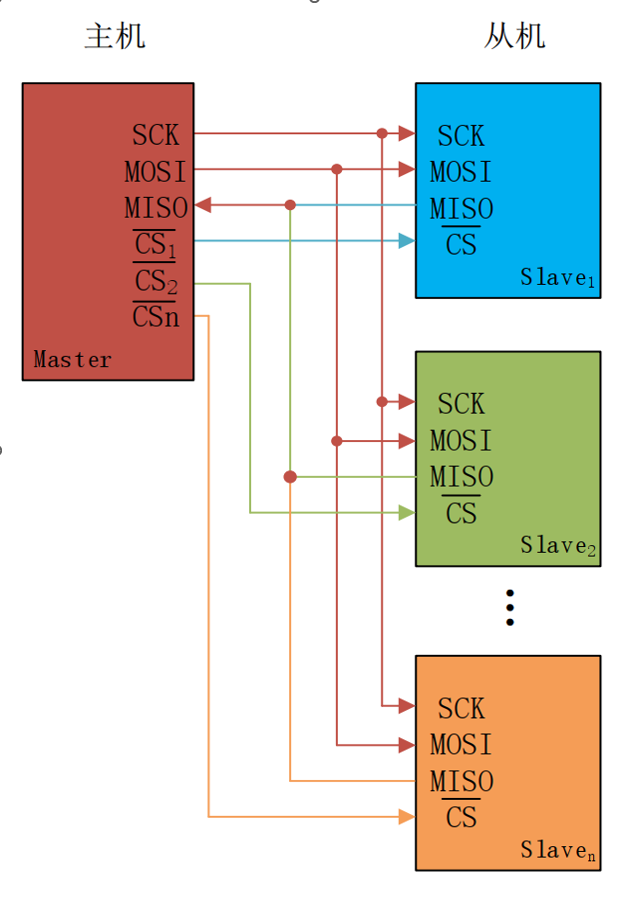

### SPI数据发送接收

SPI主机和从机都有一个串行移位寄存器，主机通过向它的SPI串行寄存器写入一个字节来发起一次传输。

1、首先拉低对应SS信号线，表示与该设备进行通信

2、主机通过发送SCLK时钟信号，来告诉从机写数据或者读数据

这里要注意，SCLK时钟信号可能是低电平有效，也可能是高电平有效，因为SPI有四种模式，这个我们在下面会介绍

3.、主机(Master)将要发送的数据写到发送数据缓存区(Menory)，缓存区经过移位寄存器(0~7)，串行移位寄存器通过MOSI信号线将字节一位一位的移出去传送给从机，，同时MISO接口接收到的数据经过移位寄存器一位一位的移到接收缓存区。

4.、、从机(Slave)也将自己的串行移位寄存器(0~7)中的内容通过MISO信号线返回给主机。同时通过MOSI信号线接收主机发送的数据，这样，两个移位寄存器中的内容就被交换。

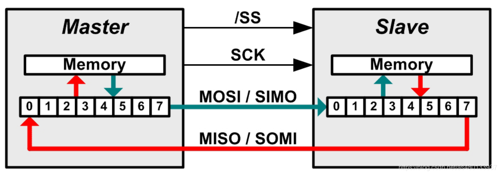

SPI只有主模式和从模式之分，没有读和写的说法，外设的写操作和读操作是同步完成的。如果只进行写操作，主机只需忽略接收到的字节；反之，若主机要读取从机的一个字节，就必须发送一个空字节来引发从机的传输。也就是说，你发一个数据必然会收到一个数据；你要收一个数据必须也要先发一个数据。

### SPI工作模式介绍

SPI通信有4种不同的操作模式，不同的从设备可能在出厂是就是配置为某种模式，这是不能改变的；STM32 要与具有 SPI 接口的器件进行通信，就必须遵循 SPI 的通信协议。每一种通信协议都有各自的读写数据时序，当然 SPI 也不例外。SPI 通信协议就具备 4 种工作模式，在讲这 4 种工作模式前，首先先知道两个单词 CPOL 和 CPHA。

​    CPOL，详称 Clock Polarity，就是时钟极性，当主从机没有数据传输的时候 SCL 线的电平 状态(即空闲状态)。假如空闲状态是高电平，CPOL = 1；若空闲状态时低电平，那么 CPOL = 0。

​    CPHA，详称 Clock Phase，就是时钟相位。在这里先科普一下数据传输的常识： 同步通信 时，数据的变化和采样都是在时钟边沿上进行的，每一个时钟周期都会有上升沿和下降沿两个 边沿，那么数据的变化和采样就分别安排在两个不同的边沿，由于数据在产生和到它稳定是需 要一定的时间，那么假如我们在第 1 个边沿信号把数据输出了，从机只能从第 2 个边沿信号去 采样这个数据。 

​    CPHA 实质指的是数据的采样时刻，CPHA = 0 的情况就表示数据的采样是从第 1 个边沿信 号上即奇数边沿，具体是上升沿还是下降沿的问题，是由 CPOL 决定的。这里就存在一个问题： 当开始传输第一个 bit 的时候，第 1 个时钟边沿就采集该数据了，那数据是什么时候输出来的 呢？那么就有两种情况：一是 CS 使能的边沿，二是上一帧数据的最后一个时钟沿。

​    CPHA = 1 的情况就是表示数据采样是从第 2 个边沿即偶数边沿，它的边沿极性要注意一 点，不是和上面 CPHA = 0 一样的边沿情况。前面的是奇数边沿采样数据，从 SCL 空闲状态的 直接跳变，空闲状态是高电平，那么它就是下降沿，反之就是上升沿。由于   CPHA = 1 是偶数边 沿采样，所以需要根据偶数边沿判断，假如第一个边沿即奇数边沿是下降沿，那么偶数边沿的 边沿极性就是上升沿。不理解的，可以看一下下面 4 种 SPI 工作模式的图。

   由于 CPOL 和 CPHA 都有两种不同状态，所以 SPI 分成了 4 种模式。我们在开发的时候， 使用比较多的是模式 0 和模式 3。下面请看SPI 工作模式表。

| SPI工作模式 | CPOL | CPHA | SCL空闲状态 | 采样边沿 | 采样时刻 |
| ----------- | ---- | ---- | ----------- | -------- | -------- |
| 0           | 0    | 0    | 低电平      | 上升沿   | 奇数边沿 |
| 1           | 0    | 1    | 低电平      | 下降沿   | 偶数边沿 |
| 2           | 1    | 0    | 高电平      | 下降沿   | 奇数边沿 |
| 3           | 1    | 1    | 高电平      | 上升沿   | 偶数边沿 |

## 相关结构体

```c
SPI_InitTypeDef

uint32_t Mode                /* SPI模式（主机）  */
uint32_t Direction            /* 工作方式（全双工） */
uint32_t DataSize            /* 帧格式（8位） */
uint32_t CLKPolarity            /* 时钟极性（CPOL = 0） */
uint32_t CLKPhase            /* 时钟相位 （CPHA = 0）*/
uint32_t NSS                /* SS控制方式（软件） */
uint32_t BaudRatePrescaler        /* SPI波特率预分频值 */
uint32_t FirstBit                /* 数据传输顺序（MSB）*/
uint32_t TIMode                /* 帧格式：Motorola / TI  */
uint32_t CRCCalculation        /* 设置硬件CRC校验 */
uint32_t CRCPolynomial        /*  设置CRC校验多项式 */
…
(对于F7/H7来说，还有一些附加功能相关成员(NSS/CRC/IOSwap))
```

## 相关函数

### SPI发送数据函数：

```c
HAL_SPI_Transmit(SPI_HandleTypeDef *hspi, uint8_t *pData, uint16_t Size, uint32_t Timeout)
```

参数:

​	*hspi: 选择SPI1/2，比如&hspi1，&hspi2
​	*pData ： 需要发送的数据，可以为数组
​	Size： 发送数据的字节数，1 就是发送一个字节数据
​	Timeout： 超时时间，就是执行发送函数最长的时间，超过该时间自动退出发送函数

### SPI接收数据函数：

```c
HAL_SPI_Receive(SPI_HandleTypeDef *hspi, uint8_t *pData, uint16_t Size, uint32_t Timeout)
```

参数:

​	*hspi: 选择SPI1/2，比如&hspi1，&hspi2
​	*pData ： 接收发送过来的数据的数组
​	Size： 接收数据的字节数，1 就是接收一个字节数据
​	Timeout： 超时时间，就是执行接收函数最长的时间，超过该时间自动退出接收函数

SPI接收发送数据

```c
HAL_SPI_TransmitReceive(SPI_HandleTypeDef *hspi, uint8_t *pTxData, uint8_t *pRxData, uint16_t Size,uint32_t Timeout)
```

### SPI中断发收函数

HAL_SPI_TransmitReceive_IT(&hspi1, TXbuf,RXbuf,CommSize);

当SPI上接收出现了 CommSize个字节的数据后，中断函数会调用SPI回调函数：

SPI接收回调函数：

HAL_SPI_TxRxCpltCallback(SPI_HandleTypeDef *hspi)

用户可以重新定义回调函数，编写预定功能即可，在接收完成之后便会进入回调函数

# RS485

## 串口简介

串口是一个泛称，UART、RS232、RS422和RS485都遵循类似的通信时序协议，被通称为串口。

UART是STM32的UART外设，由此产生串口时序，产生的电平为CMOS电平。

TTL、RS232、RS422、RS485是串行通信接口标准。简单来说，就是逻辑1和0的表示不同。

RS485相对于RS232而言：最高传输速率高（但传输速率越高传输距离越短）；采用差分法来传输信号，对共模干扰具有更强的抗干扰力；RS485允许连接128个收发器，具有多机通讯能力。

串口时序图：


| 通信接口 | 通信方式 | 信号线    | 电平标准                             | 拓扑结构 | 通信距离 | 通讯速率 | 抗干扰能力 |
| -------- | -------- | --------- | ------------------------------------ | -------- | -------- | -------- | ---------- |
| TTL      | 全双工   | TX/RX/GND | 逻辑1 : 2.4~5 V  逻辑0 : 0~0.4 V     | 点对点   | 1米      | 100kbps  | 弱         |
| RS232    | 全双工   | TX/RX/GND | 逻辑1 : -(15~3) V  逻辑0 : +(3~15) V | 点对点   | 100米    | 20kbps   | 较弱       |
| RS485    | 半双工   | 差分线AB  | 逻辑1 : +(2~6)V  逻辑0 : -(2~6)V     | 多点双向 | 1200米   | 100kbps  | 强         |

RS485特点：

​	接口电平低，不易损坏芯片
​	传输速率高
​	传输距离远，支持节点多

## RS485介绍

RS485是串行通信标准，使用差分信号传输，抗干扰能力强，常用于工控领域。

RS485具有强大的组网功能，在串口基础协议之上还制定MODBUS协议。

串口基础协议：仅指封装了基本数据包格式的协议（基于数据位）

MODBUS协议：使用基本数据包组合成通讯帧格式的高层应用协议（基于数据包或字节）

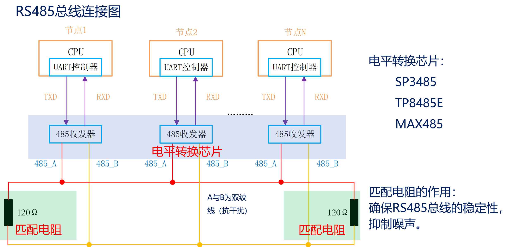

RS485电平定义：

​	对于输出：逻辑"1"以两线间的电压差为+（2 至6）V 表示；逻辑"0"以两线间的电压差为-（2 至6）V 表示。
​	对于输入：A比B高200mV以上即认为是逻辑"1",A 比B 低200mV 以上即认为是逻辑"0"。

# CAN

## 什么是CAN

### CAN 简介

CAN 是 Controller Area Network 的缩写（以下称为 CAN），是 ISO 国际标准化的串行通信 协议。在当前的汽车产业中，出于对安全性、舒适性、方便性、低公害、低成本的要求，各种 各样的电子控制系统被开发了出来。由于这些系统之间通信所用的数据类型及对可靠性的要求 不尽相同，由多条总线构成的情况很多，线束的数量也随之增加。为适应“减少线束的数量”、 “通过多个 LAN，进行大量数据的高速通信”的需要，1986 年德国电气商博世公司开发出面向汽 车的 CAN 通信协议。此后，CAN 通过 ISO11898 及 ISO11519 进行了标准化，现在在欧洲已是 汽车网络的标准协议。 

现在，CAN 的高性能和可靠性已被认同，并被广泛地应用于工业自动化、船舶、医疗设备、 工业设备等方面。现场总线是当今自动化领域技术发展的热点之一，被誉为自动化领域的计算 机局域网。它的出现为分布式控制系统实现各节点之间实时、可靠的数据通信提供了强有力的 技术支持。 

### CAN 协议具有一下特点： 

① 多主控制。在总线空闲时，所有单元都可以发送消息（多主控制），而两个以上的单元 同时开始发送消息时，根据标识符（Identifier以下称为ID）决定优先级。ID并不是表示发 送的目的地址，而是表示访问总线的消息的优先级。两个以上的单元同时开始发送消息时， 对各消息ID的每个位进行逐个仲裁比较。仲裁获胜（被判定为优先级最高）的单元可继续发送消息，仲裁失利的单元则立刻停止发送而进行接收工作。 

② 系统的柔软性。与总线相连的单元没有类似于“地址”的信息。因此在总线上增加单元 时，连接在总线上的其它单元的软硬件及应用层都不需要改变。 

③ 通信速度较快，通信距离远。最高1Mbps（距离小于40M），最远可达10KM（速率低于 5Kbps）。 

④ 具有错误检测、错误通知和错误恢复功能。所有单元都可以检测错误（错误检测功能）， 检测出错误的单元会立即同时通知其他所有单元（错误通知功能），正在发送消息的单元一 旦检测出错误，会强制结束当前的发送。强制结束发送的单元会不断反复地重新发送此消 息直到成功发送为止（错误恢复功能）。 

⑤ 故障封闭功能。CAN可以判断出错误的类型是总线上暂时的数据错误（如外部噪声等） 还是持续的数据错误（如单元内部故障、驱动器故障、断线等）。由此功能，当总线上发生 持续数据错误时，可将引起此故障的单元从总线上隔离出去。 

⑥ 连接节点多。CAN总线是可同时连接多个单元的总线。可连接的单元总数理论上是没 有限制的。但实际上可连接的单元数受总线上的时间延迟及电气负载的限制。降低通信速 度，可连接的单元数增加；提高通信速度，则可连接的单元数减少。 

正是因为 CAN 协议的这些特点，使得 CAN 特别适合工业过程监控设备的互连，因此，越 来越受到工业界的重视，并已公认为最有前途的现场总线之一。 

CAN 协议经过 ISO 标准化后有两个标准：ISO11898 标准（高速 CAN）和 ISO11519-2 标准 （低速 CAN）。其中 ISO11898 是针对通信速率为 125Kbps~1Mbps 的高速通信标准，而 ISO11519- 2 是针对通信速率为 125Kbps 以下的低速通信标准。

为了满足汽车产业的“减少线束的数量”、“通过多个LAN，进行大量数据的高速通信”的需求。

低速CAN(ISO11519)通信速率10~125Kbps，总线长度可达1000米

高速CAN(ISO11898)通信速率125Kbps~1Mbps，总线长度≤40米，又称为经典CAN。

CAN FD 通信速率可达5Mbps，并且兼容经典CAN，遵循ISO 11898-1 做数据收发。

### CAN总线拓扑图：

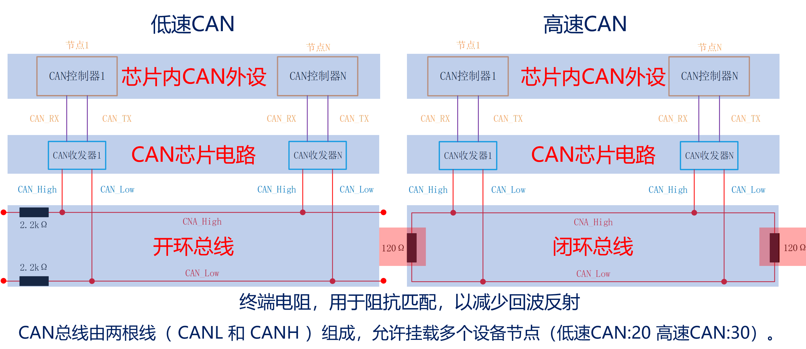

## CAN介绍

### CAN总线特点：

1. 多主控制      每个设备都可以主动发送数据
2. 系统的柔软性    没有类似地址的信息，添加设备不改变原来总线的状态
3. 通信速度      速度快，距离远
4. 错误检测&错误通知&错误恢复功能
5. 故障封闭      判断故障类型，并且进行隔离
6. 连接节点多      速度与数量找个平衡

### CAN应用场景：

CAN总线协议已广泛应用在汽车电子、工业自动化、船舶、医疗设备、工业设备等方面。

 

### CAN物理层：

CAN使用差分信号进行数据传输，根据CAN_H和CAN_L上的电位差来判断总线电平。

总线电平分为显性电平(逻辑0)和隐性电平(逻辑1)，二者必居其一。

显性电平具有优先权。发送方通过使总线电平发生变化，将消息发送给接收方。

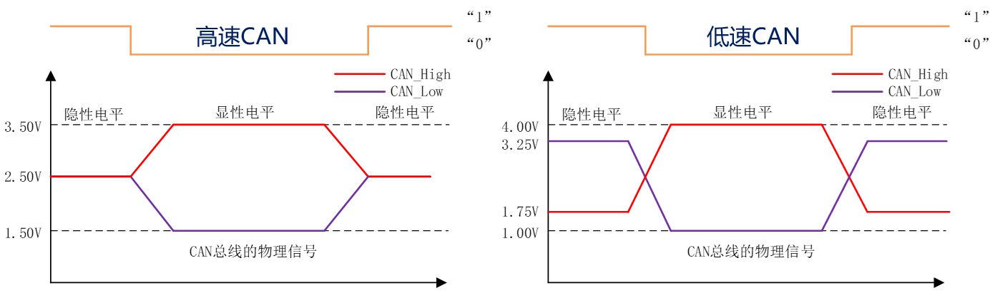

| 电平          | 高速CAN              | 低速CAN                  |
| ------------- | -------------------- | ------------------------ |
| 显性电平（0） | UCAN_H – UCAN_L= 2V  | UCAN_H – UCAN_L = 3V     |
| 隐性电平（1） | UCAN_H – UCAN_L = 0V | UCAN_H – UCAN_L = - 1.5V |

## 详细介绍

### CAN协议层： 

CAN总线以“帧”形式进行通信。CAN协议定义了5种类型的帧：数据帧、遥控帧、错误帧、过载帧、间隔帧，其中数据帧最为常用

| 帧类型                      | 帧作用                                         |
| --------------------------- | ---------------------------------------------- |
| 数据帧（Data Frame）        | 用于发送单元向接收单元传输数据的帧             |
| 遥控帧（Remote Frame）      | 用于接收单元向具有相同ID的发送单元请求数据的帧 |
| 错误帧（Error Frame）       | 用于当检测出错误时向其他单元通知错误的帧       |
| 过载帧（Overload Frame）    | 用于接收单元通知其尚未做好接收准备的帧         |
| 间隔帧（Inter Frame Space） | 用于将数据帧 及遥控帧与前面的帧分离开来的帧    |

### 数据帧介绍：

数据帧由7段组成。数据帧又分为标准帧(CAN2.0A)和扩展帧(CAN2.0B)，主要体现在仲裁段和控制段。

### 标准数据帧，数字代表位(bit)

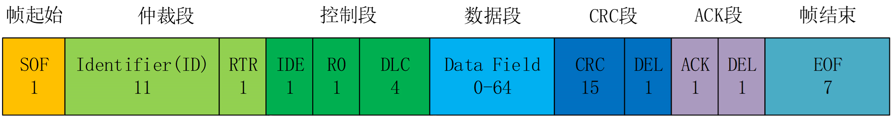


ID：标识符位

RTR：远程发送请求位，0 数据帧  1遥控帧

IDE：扩展标识符位，决定是标准帧还是扩展帧

DLC：数据长度编码位，决定数据段的长度

CRC：循环校验序列

DEL：界定符

ACK：确认位，其他设备发送显性信号表示应答

 

### 扩展数据帧，数字代表位(bit)

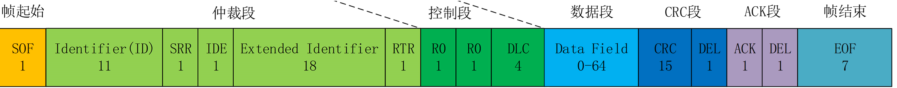

SRR：用在扩展格式，替代RTR

帧起始：表示数据帧开始的段，显性信号

仲裁段：表示该帧优先级的段，优先级

控制段：表示数据的字节数及保留位的段

数据段：数据的内容，一帧可发送0~8字节数据

CRC段：检查帧的传输错误的段

ACK段：表示确认正常接收的段

帧结束：表示数据帧结束的段，7个隐性信号

 

### CAN 总线系统中的两个时钟：

晶振时钟周期：是由单片机振荡器的晶振频率决定的，指的是振荡器每震荡一次所消耗的时间长度，也是整个系统中最小的时间单位；

CAN时钟周期：CAN时钟是由系统时钟分频而来的一个时间长度值，实际上就是一个位时序 TQ。计算公式：CAN时钟周期 = 2 × 晶振时钟周期 × BRP，其中BRP叫做波特率预分频值（baudrate prescaler）；

 

### CAN位时序介绍：

CAN总线以“位同步”机制，实现对电平的正确采样。

位数据都由四段组成：同步段(SS)、传播时间段(PTS)、相位缓冲段1(PBS1)和位缓冲段2(PBS2)，每段又由多个位时序Tq（time quanta，TQ）组成，位时序 TQ 是位时间的基本时间单元。

注意 : 节点监测到总线上信号的跳变在SS段范围内，表示节点与总线的时序是同步，此时采样点的电平即该位的电平。

采样点是指读取总线电平，并将读到的电平作为位值的点。

根据位时序，就可以计算CAN通信的波特率。

数据同步过程（解决时钟频率误差、传输上的相位延迟引起偏差）


### 硬件同步：

节点通过CAN总线发送数据，一开始发送帧起始信号。总线上其他节点会检测帧起始信号在不在位数据的SS段内，判断内部时序与总线是否同步。

假如不在SS段内，这种情况下，采样点获得的电平状态是不正确的。所以，节点会使用硬件同步方式调整， 把自己的SS段平移到检测到边沿的地方，获得同步，同步情况下，采样点获得的电平状态才是正确的。 

### 再同步：

再同步利用普通数据位的边沿信号（帧起始信号是特殊的边沿信号）进行同步。

再同步的方式分为两种情况：超前和滞后，即边沿信号与SS段的相对位置。

再同步时，PSB1和PSB2中增加或者减少的时间被称为“再同步补偿宽度（SJW）”,其范围：1~4 Tq。

限定了SJW值后，再同步时，不能增加限定长度的SJW值。SJW值较大时，吸收误差能力更强，但是通讯速度会下降。

### CAN总线仲裁

CAN总线处于空闲状态，最先开始发送消息的单元获得发送权。

多个单元同时开始发送时，从仲裁段(报文ID)的第一位开始进行仲裁。连续输出显性电平最多的单元可继续发送，即首先出现隐性电平的单元失去对总线的占有权变为接收。

## 相关函数

待定…..

## STM32 CAN控制器

STM32 CAN控制器（bxCAN），支持CAN 2.0A 和 CAN 2.0B Active版本协议。

CAN 2.0A 只能处理标准数据帧且扩展帧的内容会识别错误，而CAN 2.0B Active 可以处理标准数据帧和扩展数据帧。CAN 2.0B Passive只能处理标准数据帧且扩展帧的内容会忽略。

bxCAN主要特点：

​	波特率最高可达1M bps
​	支持时间触发通信（CAN的硬件内部定时器可以在TX/RX的帧起始位的采样点位置生成时间戳）
​	具有3级发送邮箱
​	具有3级深度的2个接收FIFO
​	可变的过滤器组（最多28个）F1，14个

### CAN控制器框图

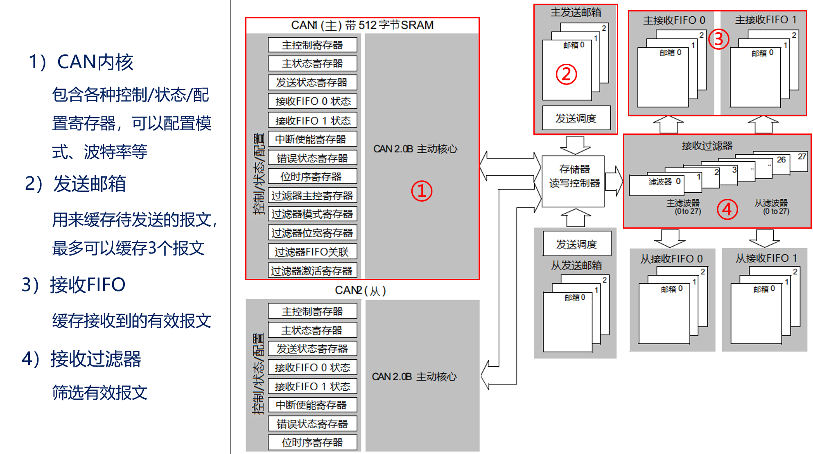

注意：F1中互联型产品才有2个CAN控制器

   F4 / F7 产品都有2个CAN控制器

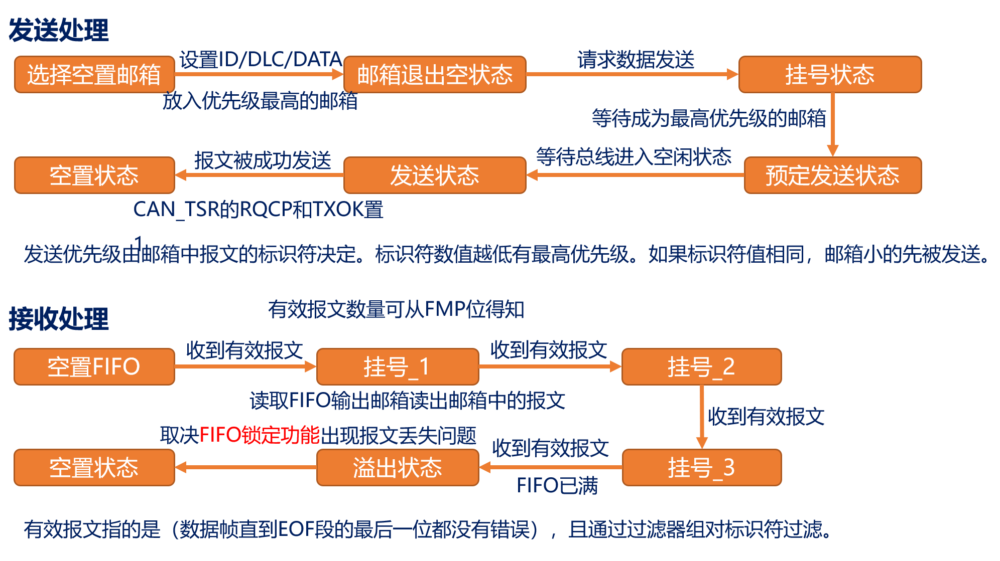

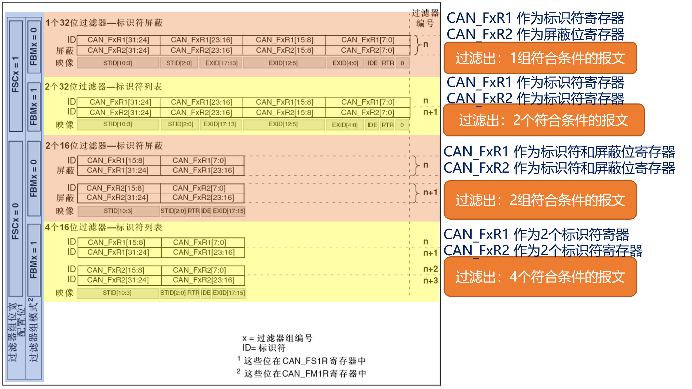

### 接收过滤器

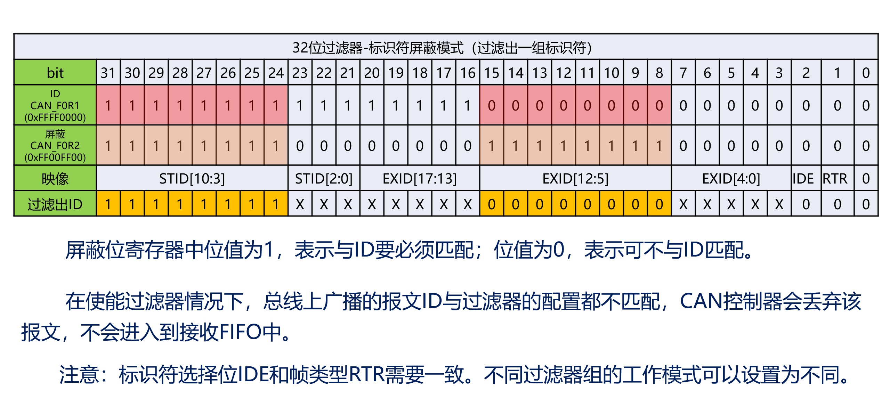

### CAN控制器位时序

STM32的CAN外设位时序分为三段：

​	同步段 SYNC_SEG
​	时间段1 BS1（PTS + PBS1）
​	时间段2 BS2 

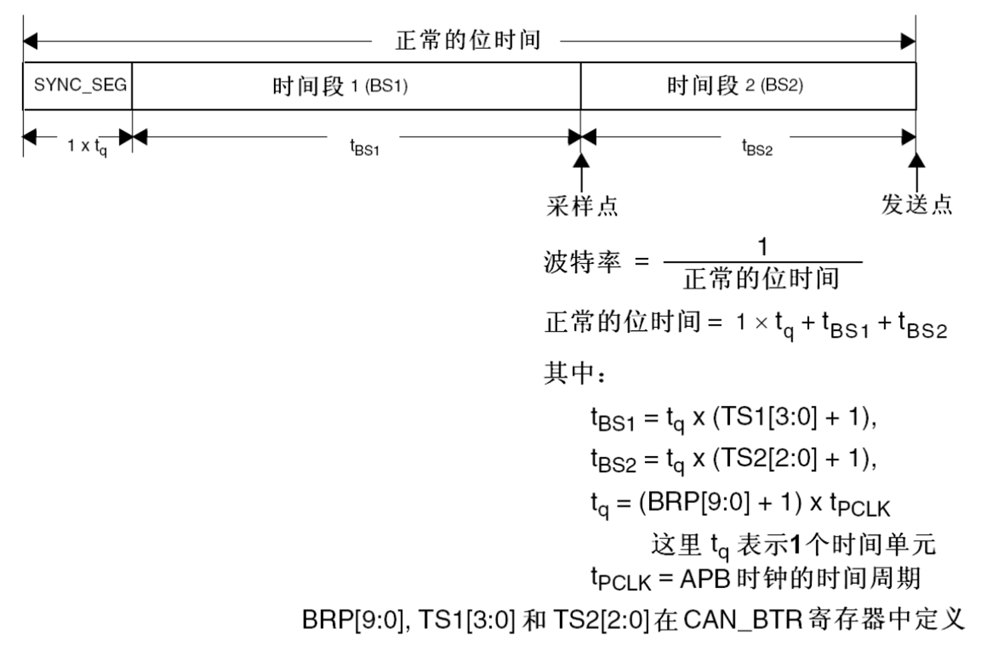

注意：通信双方波特率需要一致才能通信成功。

| 驱动函数                           | 关联寄存器                 | 功能描述          |
| ---------------------------------- | -------------------------- | ----------------- |
| __HAL_RCC_CANx_CLK_ENABLE(…)       |                            | 使能CAN时钟       |
| HAL_CAN_Init(…)                    | MCR / BTR                  | 初始化CAN         |
| HAL_CAN_ConfigFilter(…)            | 过滤器寄存器               | 配置CAN接收过滤器 |
| HAL_CAN_Start(…)                   | MCR / MSR                  | 启动CAN设备       |
| HAL_CAN_ActivateNotification(…)    | IER                        | 使能中断          |
| __HAL_CAN_ENABLE_IT(…)             | IER                        | 使能CAN中断允许   |
| HAL_CAN_AddTxMessage(…)            | TSR/TIxR/TDTxR/TDLxR/TDHxR | 发送消息          |
| HAL_CAN_GetTxMailboxesFreeLevel(…) | TSR                        | 等待发送完成      |
| HAL_CAN_GetRxFifoFillLevel(…)      | RF0R/RF1R                  | 等待接收完成      |
| HAL_CAN_GetRxMessage(…)            | RF0R/RF1R/RDLxR/RDHxR      | 接收消息          |

## 相关结构体

```c
CAN_InitTypeDef
uint32_t Prescaler            /* 预分频 */
uint32_t Mode                /* 工作模式 */
uint32_t SyncJumpWidth        /* 再次同步跳跃宽度 */
uint32_t TimeSeg1            /* 时间段1(BS1)长度 */
uint32_t TimeSeg2            /* 时间段1(BS1)长度 */
uint32_t TimeTriggeredMode    /* 时间触发通信模式 */
uint32_t AutoBusOff            /* 总线自动关闭 */
uint32_t AutoWakeUp            /* 自动唤醒 */
uint32_t AutoRetransmission     /* 自动重传 */
uint32_t ReceiveFifoLocked        /* 接收FIFO锁定 */
uint32_t TransmitFifoPriority    /*  传输FIFO优先级 */
```

```c
CAN_FilterTypeDef
uint32_t FilterIdHigh            /* ID高字节 */
uint32_t FilterIdLow            /* ID低字节 */
uint32_t FilterMaskIdHigh         /* 掩码高字节 */
uint32_t FilterMaskIdLow        /* 掩码低字节 */
uint32_t FilterFIFOAssignment    /* 过滤器关联FIFO */
uint32_t FilterBank            /* 选择过滤器组 */
uint32_t FilterMode            /* 过滤器模式*/
uint32_t FilterScale            /* 过滤器位宽 */
uint32_t FilterActivation        /* 过滤器使能 */
Uint32_t SlaveStartFilterBank     /* 从CAN选择启动过                    滤器组 单CAN没有意义*/
```

```c
CAN_TxHead
uint32_t StdId            /* 标准标识符 */
uint32_t ExtId            /* 扩展标识符 */
uint32_t IDE            /* 帧格式（标准帧或扩展帧） */
uint32_t RTR            /* 帧类型（数据帧或远程帧） */
uint32_t DLC            /* 数据长度 */
uint32_t TransmitGlobalTime    /* 发送时间标记(时间戳) */
```

```c
CAN_RxHeaderTypeDef
uint32_t StdId            
uint32_t ExtId        
uint32_t IDE    
uint32_t RTR    
uint32_t DLC        
Uint32_t Timestamp     /* 时间戳 */
uint32_t FilterMatchIndex    /* 过滤器号  */
```

# LCD

## LCD简介

Liquid Crystal Display，即液晶显示器，由：玻璃基板、背光、驱动IC等组成

全彩LCD，是一种全彩显示屏（RGB565、RGB888），可以显示各种颜色

1. 低成本
2. 高解析度
3. 高对比度
4. 响应速度快

## 显示器分类

| 显示器 | 举例                   | 优点                           | 缺点                 |
| ------ | ---------------------- | ------------------------------ | -------------------- |
| 断码屏 | 数码管、计算器、遥控器 | 成本低，驱动简单，稳定         | 色彩单一，显示内容少 |
| 点阵屏 | 户外广告屏             | 任意尺寸，亮度高               | 贵，耗电，体积大     |
| LCD屏  | 显示器、电视屏、手机屏 | 成本低，色彩好，薄，寿命长     | 全彩稍差，漏光，拖影 |
| OLED屏 | 显示器、电视屏、手机屏 | 自发光，色彩最好，超薄，功耗低 | 比较贵，寿命短       |

## LCD接口分类

| 接口 | 分辨率    | 特性                                               |
| ---- | --------- | -------------------------------------------------- |
| MCU  | ≤800*480  | 带SRAM，无需频繁刷新，无需大内存，驱动简单         |
| RGB* | ≤1280*800 | 不带SRAM，需要实时刷新，需要大内存，驱动稍微复杂   |
| MIPI | 4K        | 不带SRAM，支持分辨率高，省电，大部分手机屏用此接口 |

## 三基色原理

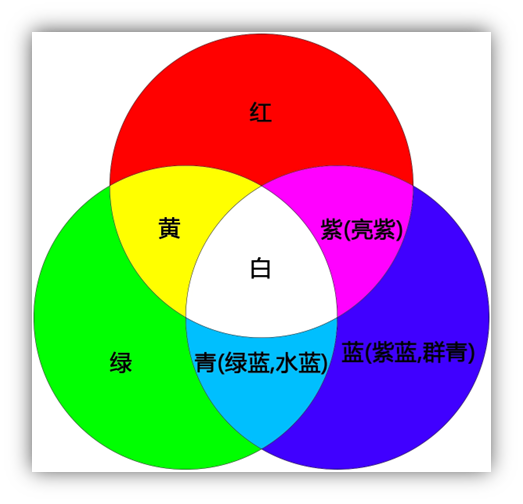

红、绿、蓝 。光学三原色混合后，组成显示屏显示颜色，三原色同时相加为白色，白色属于无色系（黑白灰）中的一种。通过三基色混合，可以得到自然界中绝大部分颜色！

电脑一般用32位来表示一个颜色（ARGB888）

| 透明度[31:24] | R[23:16] | G[15:8] | B[7:0] |
| ------------- | -------- | ------- | ------ |

单片机一般用16/24位表示一个颜色（RGB565/RGB888）

RGB565:

| 颜色 |       红       |      绿      |    蓝     |
| :--: | :------------: | :----------: | :-------: |
| bit  | 15 14 13 12 11 | 10 9 8 7 6 5 | 4 3 2 1 0 |

RGB888:

| 颜色 |           红            |          绿           |       蓝        |
| :--: | :---------------------: | :-------------------: | :-------------: |
| bit  | 23 22 21 20 19 18 17 16 | 15 14 13 12 11 10 9 8 | 7 6 5 4 3 2 1 0 |

## LCD驱动原理

LCD屏（MCU接口）驱动的核心是：驱动LCD驱动芯片

LCD驱动基本知识:

1，8080时序，LCD驱动芯片一般使用8080时序控制，实现数据写入/读取

2，初始化序列（数组），屏厂提供，用于初始化特定屏幕，不同屏幕厂家不完全相同！

3，画点函数、读点函数（非必需），基于这两个函数可以实现各种绘图功能！

## 8080时序简介

并口总线时序，常用于MCU屏驱动IC的访问，由Intel提出，也叫英特尔总线

LCD 8080时序信号说明:

| **信号**    | **名称**  | **控制状态** | **作用**                               |
| ----------- | --------- | ------------ | -------------------------------------- |
| **CS**      | 片选      | 低电平       | 选中器件，低电平有效，先选中，后操作   |
| **WR**      | 写        | ↑            | 写信号，上升沿有效，用于数据/命令写入  |
| **RD**      | 读        | ↑            | 读信号，上升沿有效，用于数据/命令读取  |
| **RS**      | 数据/命令 | 0=命/1=数    | 表示当前是读写数据还是命令，也叫DC信号 |
| **D[15:0]** | 数据线    | 无           | 双向数据线，可以写入/读取驱动IC数据    |

## 8080写时序

数据（RS=1）/命令（RS=0）在WR的上升沿，写入LCD驱动IC，RD保持高电平

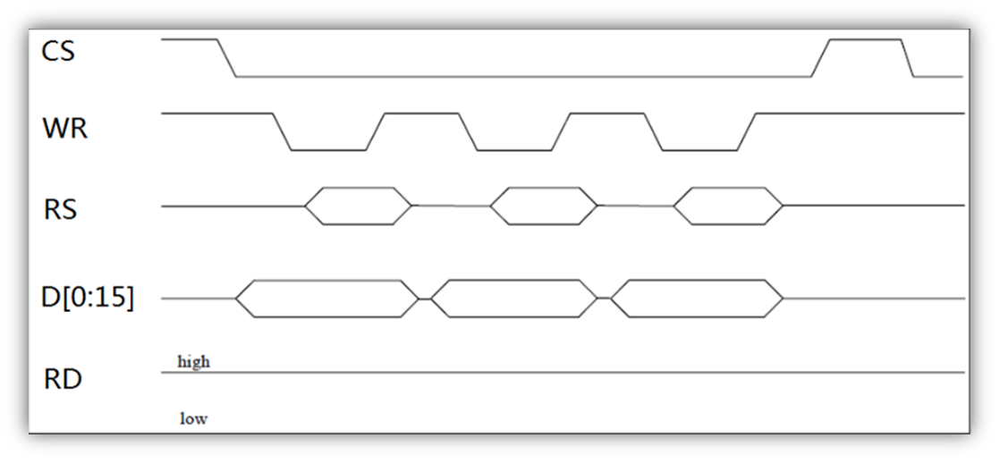

## 8080读时序

数据（RS=1）/命令（RS=0）在RD的上升沿，读取到MCU，WR保持高电平


## LCD控制结构体简介

```c
/* LCD重要参数集 */
typedef struct
{
    uint16_t 	width;     		/* LCD 宽度 */
    uint16_t 	height;    		/* LCD 高度 */
    uint16_t 	id;        		/* LCD ID */
    uint8_t 		dir;        		/* 横屏还是竖屏控制：0，竖屏；1，横屏 */
    uint16_t 	wramcmd;   	/* 开始写gram指令 */
    uint16_t 	setxcmd;   	/* 设置x坐标指令 */
    uint16_t 	setycmd;  	/* 设置y坐标指令 */
} _lcd_ev;
```

# LOW POWER

## STM32 电源系统结构介绍（F1）

器件的工作电压（VDD） 2.0~3.6V


①为了提高转换精度，给模拟外设独立供电

②电压调节器为1.8V供电区域供电，且1.8V供电区域是电源系统中最主要的部分

③两种供电方式：VBAT和VDD。主要电源被切断，该区域还能工作

##   STM32 电源系统结构介绍（F4 / F7）

器件的工作电压（VDD）1.8~3.6V

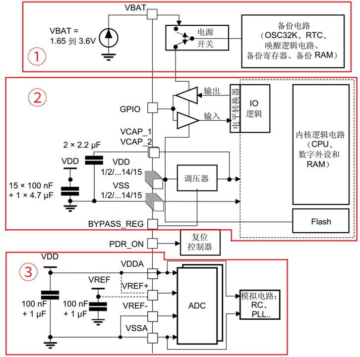

①备份域电路
​	包含LSE振荡器、RTC、备份寄存器及备份SRAM。电源开关自动切换VDD和VBAT供电

②调压器电路(1.2V域)重点部分
​	为备份域及待机电路外的所有数字电路供电，其中包括内核、数字外设及RAM

③ADC电路和参考电压
​	ADC工作电源使用VDDA引脚输入
​	使用VSSA作为独立的地连接
​	VREF引脚则为ADC提供测量使用的参考电压

## 低功耗是什么？

​	降低集成电路的能量消耗。

低功耗特性对用电池供电的产品：
	更小电池体积（降低了大小和成本） 延长电池寿命
	电磁干扰更小，提高无线通信质量
	电源设计更简单，无需过多考虑散热问题

## 低功耗模式介绍

STM32具有运行、睡眠、停止和待机四种工作模式。

上电后默认是在运行模式，当内核不需要继续运行时，可以选择后面三种低功耗模式。

低功耗模式：
 ①，睡眠模式  
 ②，停止模式  
 ③，待机模式

电源消耗不同
唤醒时间不同
唤醒源不同

## 低功耗模式表

| **模式**                     | **进入**                          | **唤醒**                                                     | **对内核电路时钟影响**                  | **对****VDD****区域时钟的影响** | **电压调节器**                                         |
| :--------------------------- | --------------------------------- | ------------------------------------------------------------ | --------------------------------------- | ------------------------------- | ------------------------------------------------------ |
| 睡眠  (立即休眠或退出时休眠) | WFI    WFE                        | 任意中断    唤醒事件                                         | CPU时钟关，对其他时钟或模拟时钟源无影响 | 无                              | 开                                                     |
| 停止                         | PDDS和LPDS位+SLEEPDEEP位+WFI或WFE | 任意外部中断（在外部中断寄存器中设置）                       | 关闭所有内核电路时钟                    | HSI和HSE的振荡器关闭            | 开启或处于低功耗模式（依据电源控制寄存器PWR_CR的设定） |
| 待机                         | PDDS位+SLEEPDEEP位+WFI或WFE       | WKUP引脚的上升沿、RTC闹钟(唤醒/入侵/时间戳)事件、NRST引脚上的外部复位、IWDG复位 | 关闭所有内核电路时钟                    | HSI和HSE的振荡器关闭            | 关                                                     |

三种模式的功耗（F1）

同等条件下（T = 25°C，VDD = 3.3V，系统时钟72MHz）

| **模式** | **主要影响**                       | **唤醒时间** | **供应电流****(****典型值****)** |
| -------- | ---------------------------------- | ------------ | -------------------------------- |
| 正常模式 | 所有外设正常工作                   | 0            | 51mA                             |
| 睡眠模式 | CPU时钟关闭                        | 1.8us        | 29.5mA                           |
| 停止模式 | 1.8V区域时钟关闭, 电压调节器低功耗 | 5.4us        | 35uA                             |
| 待机模式 | 1.8V区域时钟关闭, 电压调节器关闭   | 50us         | 3.8uA                            |

## 低功耗相关寄存器介绍 (F1)

| **寄存器** | **名称**            | **作用**                                           |
| ---------- | ------------------- | -------------------------------------------------- |
| SCB_SCR    | 系统控制寄存器      | 选择休眠和深度休眠模式，用于其他低功耗特性的控制   |
| PWR_CR     | 电源控制寄存器      | 可以设置低功耗相关（清除标记位、模式）             |
| PWR_CSR    | 电源控制/状态寄存器 | 用于查看系统当前状态（待机/唤醒标志 使能唤醒引脚） |

## 低功耗相关HAL库驱动介绍

| **驱动函数**                        | **关联寄存器** | **功能描述**         |
| ----------------------------------- | -------------- | -------------------- |
| **HAL_PWR_EnterSLEEPMode****(...)** | SCB_SCR        | 进入睡眠模式         |
| **HAL_PWR_EnterSTOPMode****(…)**    | PWR_CR/SCB_SCR | 进入停止模式         |
| **HAL_PWR_EnterSTANDBYMode****(…)** | PWR_CR/SCB_SCR | 进入待机模式         |
| **HAL_PWR_EnableWakeUpPin****(…)**  | PWR_CSR        | 使能WKUP管脚唤醒功能 |
| **__HAL_PWR_CLEAR_FLAG(…)**         | PWR_CR         | 清除PWR的相关标记    |
| **__HAL_RCC_PWR_CLK_ENABLE(…)**     | RCC_APB1ENR    | 使能电源时钟         |

## 睡眠模式配置步骤

```c
1、睡眠模式配置步骤   //参考外部中断引脚初始化
外设低功耗处理		//设置MCU外围外设进入低功耗，可选
2、进入睡眠模式	//HAL_PWR_EnterSLEEPMode
等待WKUP外部中断唤醒
```

## 停止模式配置步骤

```c
1、初始化WKUP为中断触发源		//参考外部中断引脚初始化
外设低功耗处理			//设置MCU外围外设进入低功耗，可选
2、进入停止模式			//HAL_PWR_EnterSTOPMode
等待WKUP外部中断唤醒
重新设置时钟、重新选择滴答时钟源、失能systick中断
```

## 待机模式配置步骤

```c
1、初始化WKUP为中断触发源			//参考外部中断引脚初始化，可选
外设低功耗处理						//设置MCU外围外设进入低功耗，可选
2、使能电源时钟					//__HAL_RCC_PWR_CLK_ENABLE
3、使能WKUP的唤醒功能				//HAL_PWR_EnableWakeUpPin
4、清除唤醒标记WUF					//__HAL_PWR_CLEAR_FLAG
5、进入待机模式					//HAL_PWR_EnterSTANDBYMode
```

# TOUCH

## 触摸屏简介

 触摸屏（Touch Panel），又称为“触控面板”。简单来讲，就是一种可以把触摸位置转化为坐标数据的输入设备。

触摸屏本质上与液晶屏是分离开来的。触摸屏负责检测触摸点，而液晶屏负责显示。

触摸屏按工作原理和传输介质可分为：

​	红外线式、表面声波式、电阻式和电容式

### 电阻触摸屏

 分类：四线，五线，七线和八线

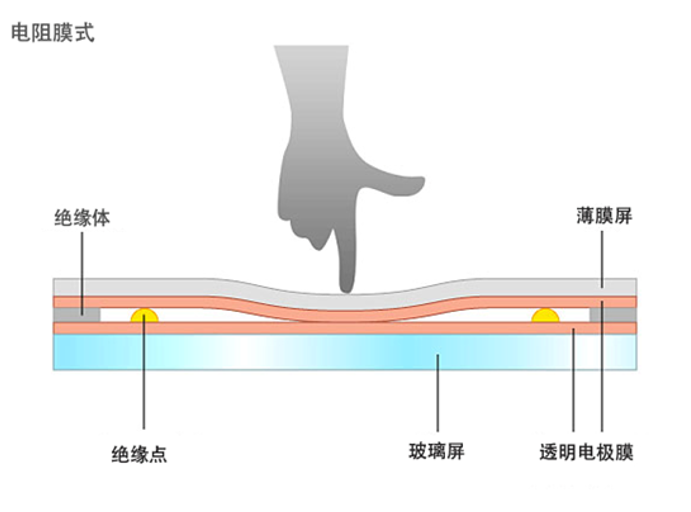

优点：精度高，价格便宜，抗干扰能力强，稳定性好

缺点：需校准，容易被划伤，透光性较差，不支持多点触摸

应用场景：广泛用于工业领域

### 电容触摸屏

利用人体感应进行触点检测控制，只需要轻微接触，通过检测感应电流定位触摸坐标。

优点：手感好、无需校准、支持多点触摸、透光性好

缺点：成本高、精度不高、抗干扰能力差

应用场景：广泛用于智能手机，平板电脑

 分类: ① 表面电容式（利用电场感应感测屏幕触摸，只能识别一次触摸）

​	   ② 投射式（利用触摸屏电极发射出静电场线）

   		自我电容（扫描电极与地构成的电容）

   		交互电容（玻璃表面的横向和纵向的ITO电极的交叉处形成的电容）

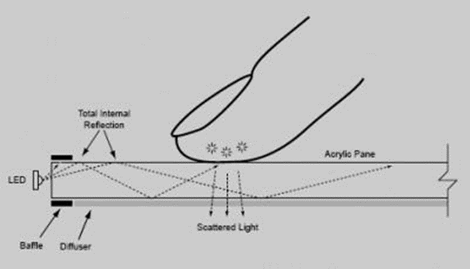

## 触摸屏原理介绍

### 电阻触摸屏原理

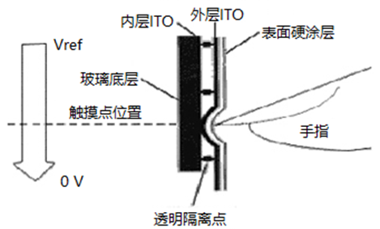

表面应涂层：保护作用

玻璃底层：用于支撑上面的结构

透明隔离点：用来分隔开外层ITO和内层ITO

ITO层：触摸屏关键结构，是涂有铟锡金属氧化物的导电层

PET层：聚脂薄膜，很薄有弹性，触摸时向下弯曲，使得ITO层接触

### 电容触摸屏原理

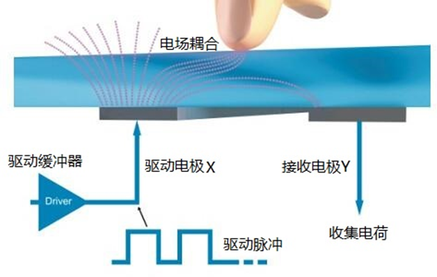

​    交互电容式触摸屏，在玻璃表面的横向和纵向的ITO电极的交叉处形成电容，扫描每个交叉处的电容变化，来判断触摸位置，即利用充电时间检测电容大小，进而通过检测出的电容值变化来获得触摸坐标。

## 触摸IC介绍

 1）电阻式触摸屏驱动IC

​	 XPT2046、TSC2046、HR2046

 2）电容式触摸屏驱动IC

 	GT9147、GT917S、GT911、GT1151、FT5426
